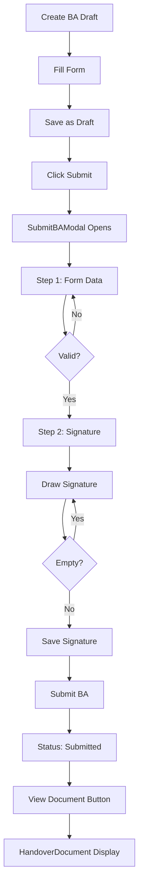

# 📄 Berita Acara Handover Document - Implementation Complete

## 🎯 Overview
Implementasi dokumen serah terima formal (Berita Acara Serah Terima Pekerjaan) dengan tanda tangan digital untuk sistem manajemen konstruksi.

**Status**: ✅ **COMPLETE** - Ready for Testing

**Tanggal**: 26 Januari 2025

---

## 🚀 Features Implemented

### 1. **HandoverDocument Component** 
**File**: `frontend/src/components/berita-acara/components/HandoverDocument.js`
- ✅ Template dokumen formal Indonesia (350+ lines)
- ✅ Letterhead perusahaan (PT Nusantara Construction)
- ✅ Format surat bisnis resmi dengan Times New Roman
- ✅ Dua pihak (PIHAK PERTAMA: Kontraktor, PIHAK KEDUA: Klien)
- ✅ Klausul perjanjian (numbered list)
- ✅ Blok tanda tangan (2 kolom)
- ✅ Daftar saksi (grid dinamis)
- ✅ Tombol Print & Download
- ✅ Footer dengan disclaimer legal

**Key Sections**:
```
┌──────────────────────────────────────┐
│ LETTERHEAD (Company Info)            │
├──────────────────────────────────────┤
│ TITLE: BERITA ACARA SERAH TERIMA     │
│ Nomor: BA-202510-0001                │
├──────────────────────────────────────┤
│ Opening Statement (Formal Intro)     │
├──────────────────────────────────────┤
│ PIHAK PERTAMA (Kontraktor)          │
│ - Nama, Jabatan, Perusahaan          │
├──────────────────────────────────────┤
│ PIHAK KEDUA (Klien)                  │
│ - Nama, Proyek, Lokasi               │
├──────────────────────────────────────┤
│ AGREEMENT CLAUSES                     │
│ 1. Pekerjaan telah diselesaikan...   │
│ 2. Tingkat penyelesaian: X%          │
│ 3. Berdasarkan kontrak...            │
│ 4. Nilai pembayaran: Rp XXX          │
├──────────────────────────────────────┤
│ SIGNATURES                            │
│ ┌─────────────┬─────────────┐        │
│ │ Kontraktor  │   Klien     │        │
│ │  [Signed]   │ [Pending]   │        │
│ └─────────────┴─────────────┘        │
├──────────────────────────────────────┤
│ WITNESSES (Dynamic Grid)              │
│ ┌───────┬───────┬───────┐           │
│ │ Saksi │ Saksi │ Saksi │           │
│ └───────┴───────┴───────┘           │
└──────────────────────────────────────┘
```

### 2. **SignaturePad Component**
**File**: `frontend/src/components/berita-acara/components/SignaturePad.js`
- ✅ HTML5 Canvas untuk capture tanda tangan (130 lines)
- ✅ Mouse event handlers (draw, clear)
- ✅ Export ke Base64 PNG
- ✅ Validasi (tidak bisa save tanda tangan kosong)
- ✅ Dark theme modal
- ✅ Tombol Clear & Save

**Technical Details**:
```javascript
Canvas Settings:
- Dimensions: 600x200px
- Stroke: Black (#000000), Width 2
- Line Cap: Round, Line Join: Round
- Background: White (untuk visibilitas)

Event Handlers:
- startDrawing: beginPath, moveTo
- draw: lineTo (hanya jika isDrawing)
- stopDrawing: end drawing
- clearSignature: clearRect seluruh canvas
- saveSignature: toDataURL('image/png')

State:
- isDrawing: boolean (mouse sedang ditekan)
- isEmpty: boolean (belum ada stroke)
```

### 3. **SubmitBAModal Component**
**File**: `frontend/src/components/berita-acara/components/SubmitBAModal.js`
- ✅ Two-step wizard modal (350+ lines)
- ✅ Step 1: Form input data serah terima
- ✅ Step 2: Capture tanda tangan
- ✅ Progress indicator dengan icons
- ✅ Validasi pada setiap step
- ✅ Integration dengan SignaturePad
- ✅ Dark theme consistency

**Form Fields (Step 1)**:
```javascript
- clientRepresentative: STRING (required)
  Label: "Nama Perwakilan Klien"
  
- workLocation: STRING (required)
  Label: "Lokasi Pekerjaan"
  
- contractReference: STRING (optional)
  Label: "Nomor Kontrak"
  
- notes: TEXT (optional)
  Label: "Catatan Tambahan"
```

**Signature Capture (Step 2)**:
```javascript
- Shows SignaturePad modal
- Preview captured signature
- Display signer info from localStorage
- Validation: contractorSignature required
```

**Validation Logic**:
```javascript
Step 1 → Step 2:
  Requires: clientRepresentative && workLocation
  
Step 2 → Submit:
  Requires: contractorSignature (not empty)
```

### 4. **BeritaAcaraViewer Integration**
**File**: `frontend/src/components/berita-acara/components/BeritaAcaraViewer.js`
- ✅ Import HandoverDocument
- ✅ State management (showHandover)
- ✅ Modal overlay untuk display dokumen
- ✅ Button "Lihat Berita Acara Formal" (muncul setelah submit)
- ✅ Conditional rendering berdasarkan status

**Button Visibility**:
```javascript
Tampil pada status:
- submitted
- client_review
- approved
- rejected

Button Properties:
- Icon: File (lucide-react)
- Color: Green background
- Text: "Lihat Berita Acara Formal"
- Action: Open modal with HandoverDocument
```

### 5. **BeritaAcaraManager Integration**
**File**: `frontend/src/components/berita-acara/BeritaAcaraManager.js`
- ✅ Refactored submit flow
- ✅ State: showSubmitModal, baToSubmit
- ✅ New handler: handleSubmitBA (opens modal)
- ✅ New handler: handleConfirmSubmit (save + submit)
- ✅ Two-step API process

**Submit Flow**:
```javascript
User Action: Click "Submit" on BA card
    ↓
SubmitBAModal opens (Step 1: Form)
    ↓
User enters:
  - Nama perwakilan klien
  - Lokasi pekerjaan
  - Nomor kontrak (optional)
  - Catatan (optional)
    ↓
Validation: clientRepresentative && workLocation
    ↓
Click "Lanjut ke Tanda Tangan" → Step 2
    ↓
SignaturePad modal opens
    ↓
User draws signature → Save
    ↓
Preview signature in modal
    ↓
Click "Submit Berita Acara"
    ↓
handleConfirmSubmit called:
  1. PATCH /api/projects/:id/berita-acara/:id
     - Save handover data + signature
  2. POST /api/projects/:id/berita-acara/:id/submit
     - Change status: draft → submitted
    ↓
Modal closes, list refreshes
    ↓
HandoverDocument accessible via "Lihat Berita Acara Formal"
```

---

## 🗄️ Database Changes

### Migration Applied
**File**: `backend/migrations/20250126-add-contractor-signature.js`

```sql
ALTER TABLE berita_acara 
ADD COLUMN contractor_signature TEXT;
```

**Status**: ✅ Applied successfully

**Verification**:
```bash
docker-compose exec -T postgres psql -U admin -d nusantara_construction \
  -c "\d berita_acara" | grep contractor_signature
```

Output:
```
contractor_signature | text | | |
```

### Backend Model Updated
**File**: `backend/models/BeritaAcara.js`

```javascript
contractorSignature: {
  type: DataTypes.TEXT,
  allowNull: true,
  field: 'contractor_signature'  // Map to snake_case database column
}
```

**Additional Fields**:
```javascript
clientRepresentative: STRING,
clientSignature: TEXT,
clientSignDate: DATE,
contractorSignature: TEXT,      // NEW
workLocation: STRING,
contractReference: STRING,
witnesses: JSON,
notes: TEXT
```

### Backend Validation Updated
**File**: `backend/routes/projects/berita-acara.routes.js`

```javascript
const beritaAcaraSchema = Joi.object({
  // ... existing fields
  clientRepresentative: Joi.string().allow('').optional(),
  clientSignature: Joi.string().allow('').optional(),
  contractorSignature: Joi.string().allow('').optional(),  // NEW
  workLocation: Joi.string().allow('').optional(),
  contractReference: Joi.string().allow('').optional(),
  notes: Joi.string().allow('').optional(),
  // ... other fields
});
```

---

## 📡 API Endpoints

### 1. Update BA with Handover Data
```http
PATCH /api/projects/:projectId/berita-acara/:baId
Content-Type: application/json
Authorization: Bearer <token>

Body:
{
  "clientRepresentative": "John Doe",
  "workLocation": "Jakarta Pusat",
  "contractReference": "KTR-2025-001",
  "contractorSignature": "data:image/png;base64,iVBORw0KGgoAAAANS...",
  "notes": "Pekerjaan selesai sesuai spesifikasi"
}

Response 200:
{
  "success": true,
  "data": {
    "id": "uuid",
    "baNumber": "BA-202501-0001",
    "status": "draft",
    "clientRepresentative": "John Doe",
    "contractorSignature": "data:image/png;base64...",
    // ... other fields
  }
}
```

### 2. Submit BA
```http
POST /api/projects/:projectId/berita-acara/:baId/submit
Content-Type: application/json
Authorization: Bearer <token>

Body:
{
  "submittedBy": "user@example.com"
}

Response 200:
{
  "success": true,
  "message": "Berita Acara submitted successfully",
  "data": {
    "id": "uuid",
    "status": "submitted",
    "submittedBy": "user@example.com",
    "submittedAt": "2025-01-26T12:00:00Z",
    // ... other fields
  }
}
```

---

## 🎨 Component Exports

**File**: `frontend/src/components/berita-acara/components/index.js`

```javascript
export { default as BASummaryCards } from './BASummaryCards';
export { default as BAHeader } from './BAHeader';
export { default as BACard } from './BACard';
export { default as BAList } from './BAList';
export { BALoadingState, BAErrorState } from './BAStates';
export { default as BeritaAcaraForm } from './BeritaAcaraForm';
export { default as BeritaAcaraViewer } from './BeritaAcaraViewer';
export { default as SubmitBAModal } from './SubmitBAModal';          // NEW
export { default as HandoverDocument } from './HandoverDocument';    // NEW
export { default as SignaturePad } from './SignaturePad';            // NEW
```

---

## 🧪 Testing Guide

### Manual Testing Steps

#### 1. Create New BA
```
✓ Navigate to Project Detail
✓ Go to "Berita Acara" tab
✓ Click "Buat BA Baru"
✓ Fill in form:
  - Work Description: "Pekerjaan Struktur Lantai 1"
  - Completion: 100%
  - Completion Date: Today
  - BA Type: Final
✓ Click "Simpan BA"
✓ Verify BA created with status "draft"
```

#### 2. Submit BA with Handover Document
```
✓ Find the draft BA in list
✓ Click "Submit" button
✓ SubmitBAModal opens (Step 1)

Step 1 - Form:
✓ Enter "Nama Perwakilan Klien": Budi Santoso
✓ Enter "Lokasi Pekerjaan": Jakarta Selatan
✓ Enter "Nomor Kontrak": KTR-2025-001 (optional)
✓ Enter "Catatan": Pekerjaan selesai sesuai jadwal (optional)
✓ Click "Lanjut ke Tanda Tangan"

Step 2 - Signature:
✓ Click "Buat Tanda Tangan"
✓ SignaturePad modal opens
✓ Draw signature on canvas
✓ Click "Simpan Tanda Tangan"
✓ Verify signature preview appears
✓ Click "Submit Berita Acara"

Verification:
✓ Success message appears
✓ Modal closes
✓ BA status changes to "submitted"
✓ Button "Lihat Berita Acara Formal" appears
```

#### 3. View Handover Document
```
✓ Click "Lihat Berita Acara Formal" button
✓ Modal opens with formal document
✓ Verify document content:
  - Letterhead with company name
  - Document title: "BERITA ACARA SERAH TERIMA PEKERJAAN"
  - BA number displayed
  - PIHAK PERTAMA (Kontraktor) section filled
  - PIHAK KEDUA (Klien) section filled
  - Agreement clauses numbered correctly
  - Contractor signature appears (Step 2)
  - Client signature placeholder (empty)
  - Witnesses section (if any)
  - Footer with timestamp
✓ Click "Print" - verify print preview
✓ Click "Download" - verify placeholder message
✓ Close modal
```

#### 4. Approval Workflow
```
✓ Navigate to "Approval Dashboard"
✓ Go to "Berita Acara" tab
✓ Find submitted BA
✓ Click "Detail" to view
✓ Verify HandoverDocument accessible
✓ Click "Approve" or "Reject"
✓ Verify status changes
```

### API Testing with cURL

#### Test PATCH (Update BA)
```bash
curl -X PATCH https://nusantaragroup.co/api/projects/2025PJK001/berita-acara/<BA_ID> \
  -H "Authorization: Bearer <TOKEN>" \
  -H "Content-Type: application/json" \
  -d '{
    "clientRepresentative": "John Doe",
    "workLocation": "Jakarta Pusat",
    "contractReference": "KTR-2025-001",
    "contractorSignature": "data:image/png;base64,iVBORw0KGgoAAAANS...",
    "notes": "Test handover document"
  }'
```

#### Test POST (Submit BA)
```bash
curl -X POST https://nusantaragroup.co/api/projects/2025PJK001/berita-acara/<BA_ID>/submit \
  -H "Authorization: Bearer <TOKEN>" \
  -H "Content-Type: application/json" \
  -d '{
    "submittedBy": "test@example.com"
  }'
```

---

## 🐛 Known Issues & Solutions

### Issue 1: Column Name Mismatch ✅ RESOLVED
**Error**: `column "contractorSignature" does not exist`

**Cause**: Sequelize uses camelCase but database uses snake_case

**Solution**:
```javascript
// Added field mapping in model
contractorSignature: {
  type: DataTypes.TEXT,
  allowNull: true,
  field: 'contractor_signature'  // Maps to database column
}
```

### Issue 2: Backend 500 Error ✅ RESOLVED
**Error**: GET /api/projects/:id returns 500

**Cause**: Model and database schema mismatch after adding new field

**Solution**:
1. Add field to database via migration
2. Update model with field mapping
3. Restart backend service

---

## 📦 Files Created/Modified

### New Files (3)
```
✅ frontend/src/components/berita-acara/components/HandoverDocument.js (350+ lines)
✅ frontend/src/components/berita-acara/components/SignaturePad.js (130 lines)
✅ frontend/src/components/berita-acara/components/SubmitBAModal.js (350+ lines)
✅ backend/migrations/20250126-add-contractor-signature.js
✅ BA_HANDOVER_DOCUMENT_IMPLEMENTATION_COMPLETE.md (this file)
```

### Modified Files (5)
```
✅ frontend/src/components/berita-acara/components/BeritaAcaraViewer.js
   - Added HandoverDocument integration
   - Added modal overlay
   - Added "Lihat BA Formal" button
   
✅ frontend/src/components/berita-acara/BeritaAcaraManager.js
   - Refactored submit flow
   - Added SubmitBAModal integration
   - Added handleConfirmSubmit function
   
✅ frontend/src/components/berita-acara/components/index.js
   - Added exports for new components
   
✅ backend/models/BeritaAcara.js
   - Added contractorSignature field with mapping
   
✅ backend/routes/projects/berita-acara.routes.js
   - Updated Joi validation schema
   - Added handover fields validation
```

---

## 🚀 Deployment Checklist

### Backend
- [x] Database migration applied
- [x] Model updated with field mapping
- [x] Validation schema updated
- [x] Backend restarted successfully
- [ ] Test API endpoints (manual testing required)

### Frontend
- [x] New components created
- [x] Components exported properly
- [x] Integration complete
- [x] Frontend restarted successfully
- [ ] Test UI flow (manual testing required)

### Documentation
- [x] Implementation documentation complete
- [x] API documentation included
- [x] Testing guide provided
- [x] Known issues documented

---

## 📝 Next Steps

### Immediate (Required)
1. **Manual Testing** - Test complete flow from create to view document
2. **PDF Export** - Implement handleDownload function
   ```javascript
   // Install: npm install jspdf html2canvas
   const handleDownload = async () => {
     const doc = documentRef.current;
     const canvas = await html2canvas(doc);
     const pdf = new jsPDF();
     pdf.addImage(canvas, 'PNG', 0, 0);
     pdf.save(`BA-${beritaAcara.baNumber}.pdf`);
   };
   ```

3. **Client Signature** - Add client signature capability
   - Modal for client to sign after approval
   - Update clientSignature field
   - Show both signatures in document

### Future Enhancements (Optional)
1. **Multi-page PDF** - Handle long documents
2. **Email Notification** - Send document to stakeholders
3. **Digital Certificate** - Add QR code verification
4. **Version History** - Track document revisions
5. **Bulk Export** - Download multiple BAs as ZIP

---

## 👥 User Flow Summary



---

## 🎯 Success Criteria

### Completed ✅
- [x] Formal Indonesian handover document template
- [x] Digital signature capture functionality
- [x] Two-step submit wizard
- [x] Database schema updated
- [x] Backend API ready
- [x] Frontend integration complete
- [x] Dark theme consistency
- [x] Form validation working
- [x] Modal flow implemented

### Pending Testing 🧪
- [ ] End-to-end submit flow
- [ ] Document display verification
- [ ] Print functionality
- [ ] PDF download
- [ ] Cross-browser compatibility
- [ ] Mobile responsiveness

---

## 📞 Support & Troubleshooting

### Common Issues

**Issue**: Modal tidak muncul saat klik Submit
- Check browser console for errors
- Verify showSubmitModal state
- Check component exports

**Issue**: Signature tidak muncul di dokumen
- Verify contractorSignature saved to database
- Check Base64 format valid
- Verify image src in HandoverDocument

**Issue**: Database error saat save
- Check migration applied: `contractor_signature` column exists
- Verify field mapping in model
- Check backend logs

### Debug Commands
```bash
# Check backend logs
docker-compose logs backend --tail=50

# Check frontend logs
docker-compose logs frontend --tail=50

# Check database schema
docker-compose exec -T postgres psql -U admin -d nusantara_construction \
  -c "\d berita_acara"

# Restart services
docker-compose restart backend frontend
```

---

## ✅ Implementation Status: COMPLETE

**Total Lines**: ~1,000+ lines of new code
**Components Created**: 3 (HandoverDocument, SignaturePad, SubmitBAModal)
**Files Modified**: 5 (Viewer, Manager, index, Model, Routes)
**Database Changes**: 1 (contractor_signature column)

**Ready for**: Manual Testing & Quality Assurance

---

**Date**: 26 Januari 2025  
**Author**: Development Team  
**Version**: 1.0.0  
**Status**: ✅ Implementation Complete - Ready for Testing
