# 📊 Diagram Visual Sistem Nusantara - Mudah Dipahami

**Versi**: 2.0  
**Tanggal**: 25 Oktober 2025  
**Bahasa**: Indonesia (dengan istilah teknis dalam English)

---

## 📑 Daftar Diagram

1. [Struktur Role & Permission](#diagram-1-struktur-role--permission)
2. [Siklus Proyek Lengkap](#diagram-2-siklus-proyek-lengkap)
3. [Workflow RAB ke Milestone](#diagram-3-workflow-rab-ke-milestone)
4. [Workflow Berita Acara](#diagram-4-workflow-berita-acara)
5. [Workflow Progress Payment](#diagram-5-workflow-progress-payment)
6. [Workflow Purchase Order](#diagram-6-workflow-purchase-order)
7. [Workflow Attendance](#diagram-7-workflow-attendance)
8. [Arsitektur Sistem](#diagram-8-arsitektur-sistem)

---

## Diagram 1: Struktur Role & Permission

### Hierarki Role

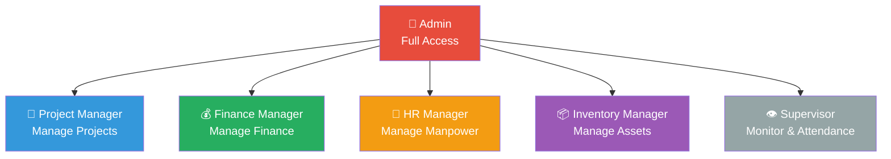

### Permission Matrix

| Aksi | Admin | PM | Finance | Supervisor | Inv Mgr | HR Mgr |
|------|-------|-----|---------|------------|---------|---------|
| **Create Project** | ✅ | ✅ | ❌ | ❌ | ❌ | ❌ |
| **Approve RAB** | ✅ | ❌ | ❌ | ❌ | ❌ | ❌ |
| **Create BA** | ✅ | ✅ | ❌ | ❌ | ❌ | ❌ |
| **Approve BA** | ✅ | ❌ | ❌ | ❌ | ❌ | ❌ |
| **Approve PO** | ✅ | ❌ | ✅ | ❌ | ❌ | ❌ |
| **Process Payment** | ✅ | ❌ | ✅ | ❌ | ❌ | ❌ |
| **Manage Manpower** | ✅ | 👁️ | 👁️ | 👁️ | ❌ | ✅ |
| **Clock In/Out** | ✅ | ✅ | ✅ | ✅ | ✅ | ✅ |

**Legend**: ✅ Full Access | 👁️ Read Only | ❌ No Access

---

## Diagram 2: Siklus Proyek Lengkap

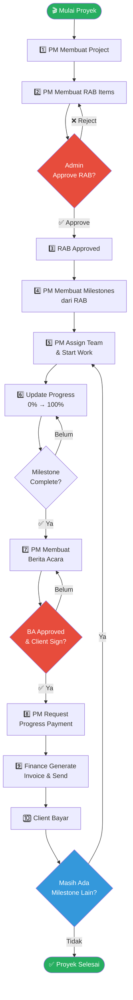

---

## Diagram 3: Workflow RAB ke Milestone

### Proses RAB Approval

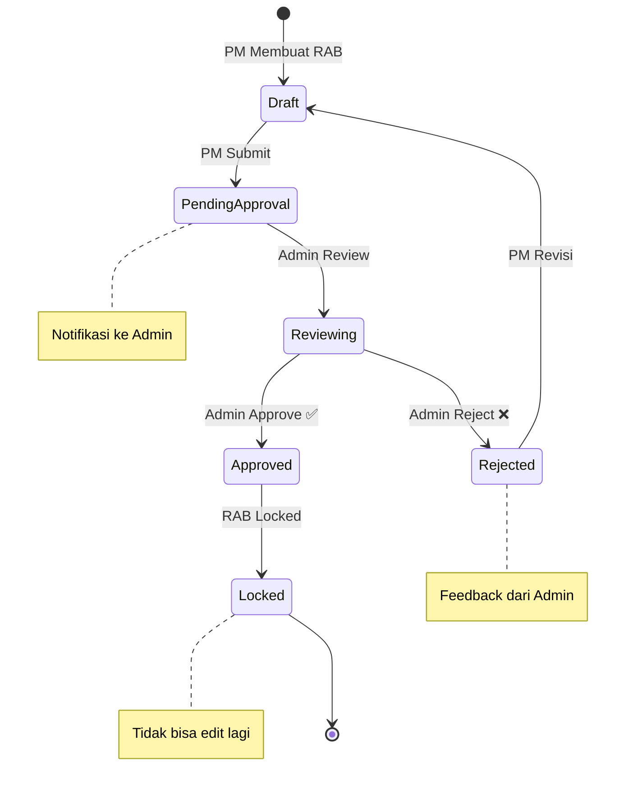

### RAB ke Milestone

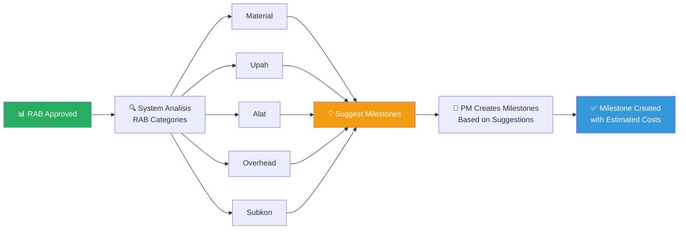

---

## Diagram 4: Workflow Berita Acara

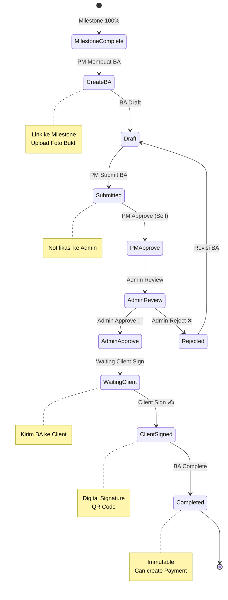

### Approval Chain

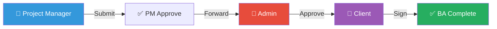

---

## Diagram 5: Workflow Progress Payment

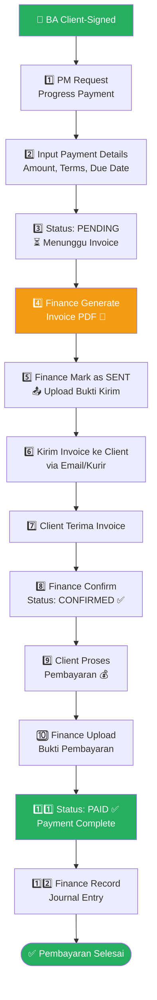

### Status Timeline

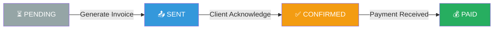

---

## Diagram 6: Workflow Purchase Order

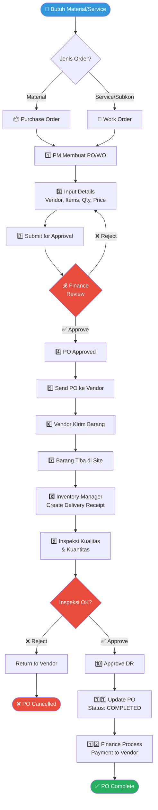

### PO Status Flow

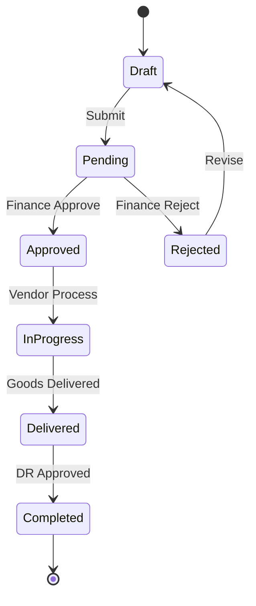

---

## Diagram 7: Workflow Attendance

### Daily Clock In/Out

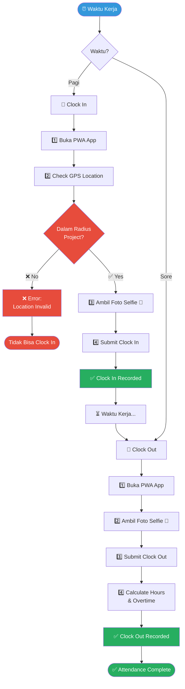

### Leave Request Flow

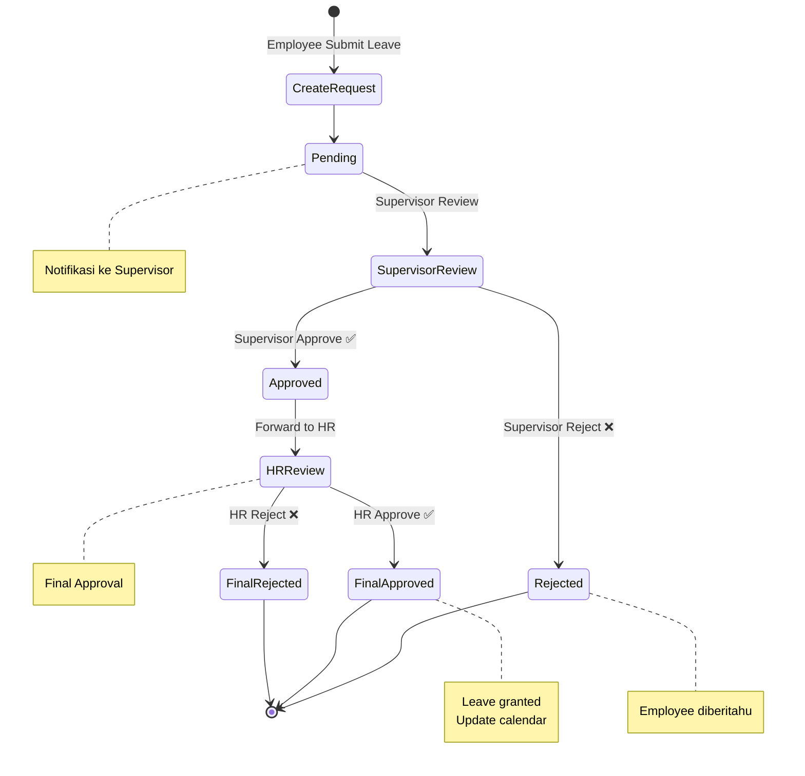

---

## Diagram 8: Arsitektur Sistem

### Technology Stack

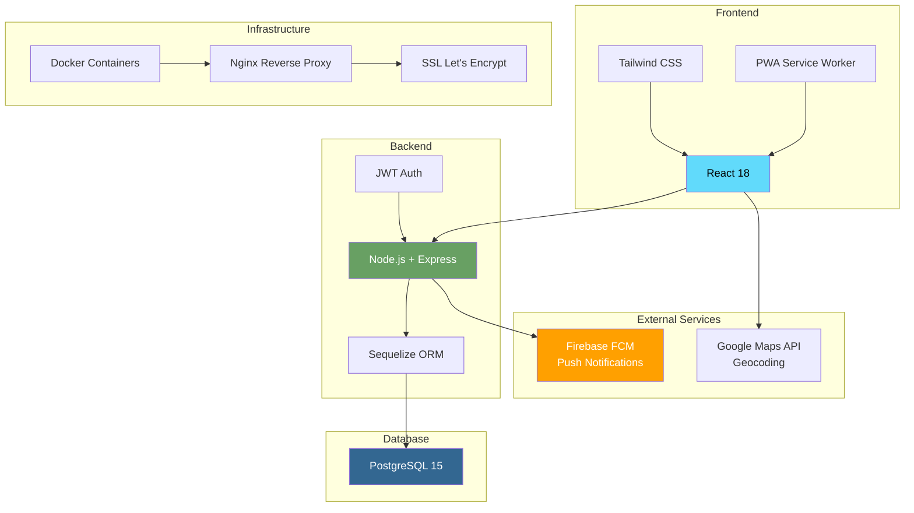

### Deployment Architecture

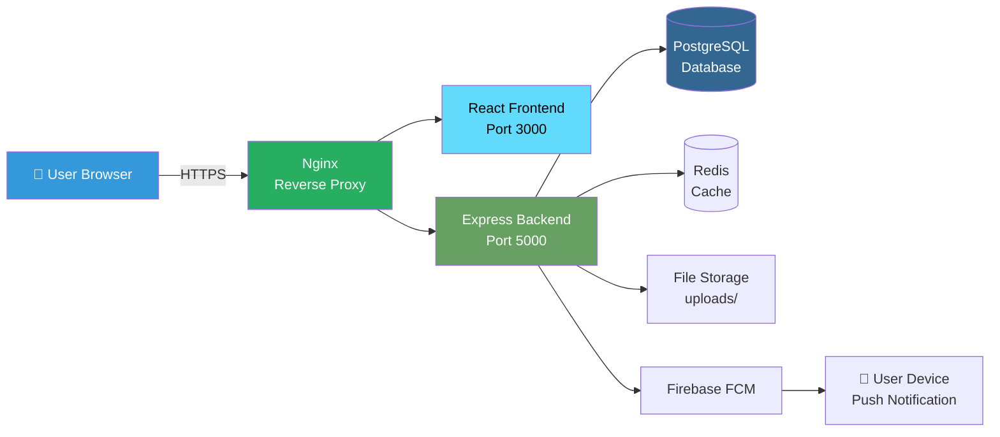

### Data Flow

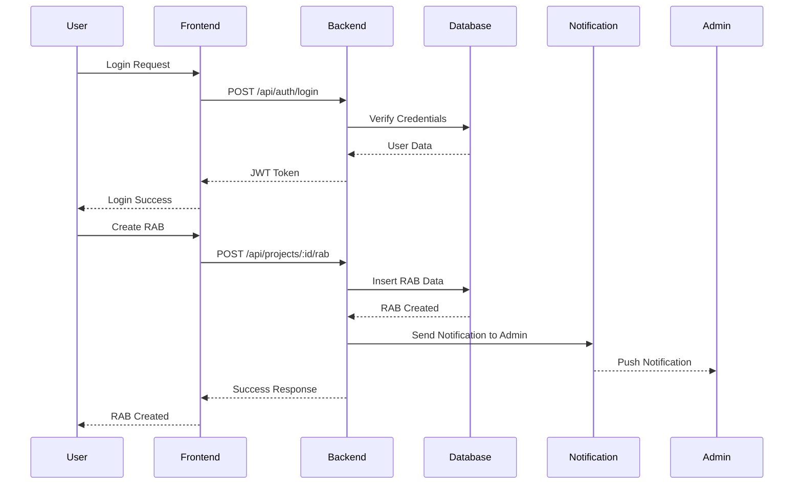

---

## 📊 Ringkasan Modul

### Modul Utama (10 Modul)

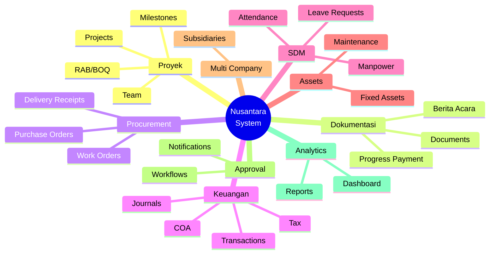

---

## 🎯 Quick Reference: Siapa Bisa Apa?

### Admin = Full Control ✅

```
✅ Approve semua workflow (RAB, BA, PO, Payment)
✅ Create/Edit/Delete semua data
✅ Manage users & subsidiaries
✅ View semua reports
✅ System settings
```

### Project Manager = Project Focus 👷

```
✅ Manage projects (Create, Edit)
✅ Create RAB → Submit untuk approval
✅ Create Milestones
✅ Create Berita Acara → Submit untuk approval
✅ Request Progress Payment
✅ Create PO/WO → Submit untuk approval
❌ Tidak bisa approve apapun
❌ Tidak bisa manage users
```

### Finance Manager = Money Focus 💰

```
✅ Approve PO/WO
✅ Process payments
✅ Generate invoices
✅ Manage COA & journals
✅ Financial reports
❌ Tidak bisa create projects
❌ Tidak bisa create RAB/BA
```

### Supervisor = Monitor Only 👁️

```
✅ View projects & reports
✅ Clock in/out attendance
✅ Approve leave requests (team)
❌ Tidak bisa create/edit apapun
❌ Tidak bisa approve workflows
```

### Inventory Manager = Asset Focus 📦

```
✅ Manage fixed assets
✅ Receive & inspect deliveries
✅ Create delivery receipts
❌ TIDAK ADA stock management
❌ TIDAK ADA material inventory
```

### HR Manager = Manpower Focus 👥

```
✅ Manage employee data (manpower)
✅ View attendance reports
✅ Approve leave requests
❌ TIDAK ADA payroll
❌ TIDAK ADA recruitment
❌ TIDAK ADA training
```

---

## 🔗 Hubungan Antar Modul

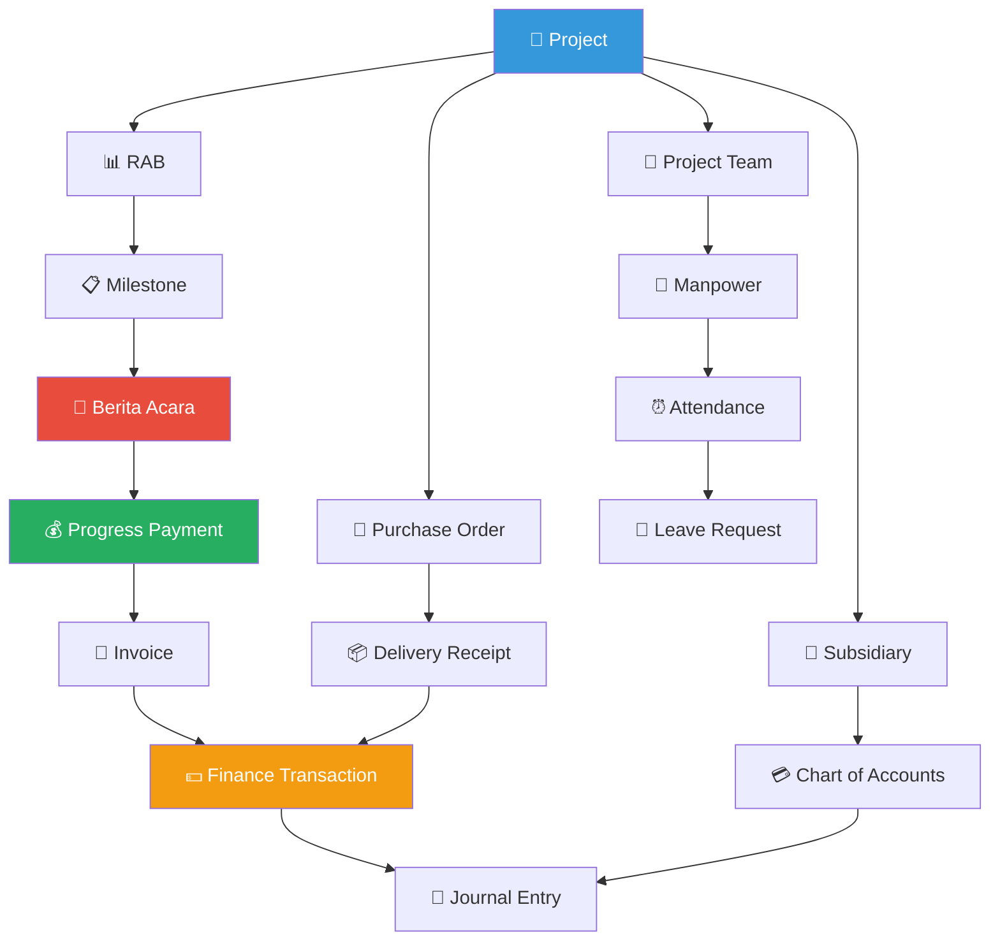

---

## 📱 PWA Features

### What is PWA?

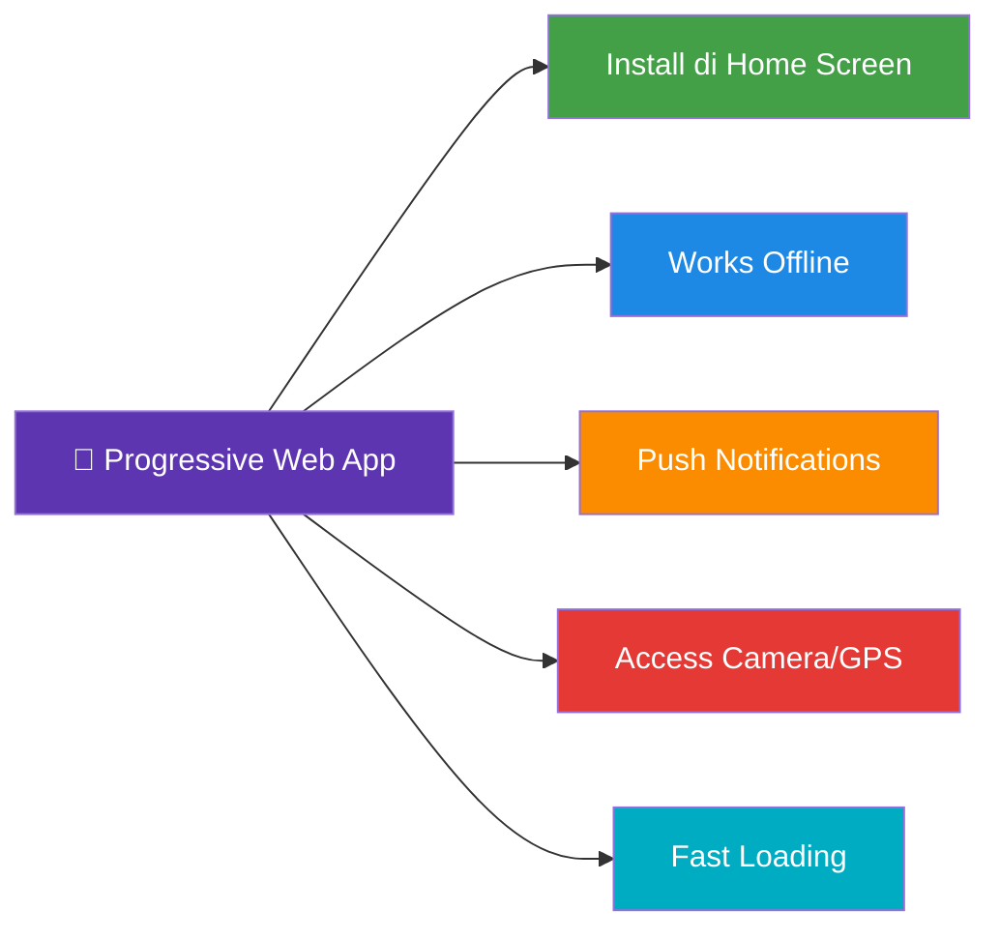

### Use Cases

- ✅ **Attendance**: Clock in/out di lapangan tanpa buka browser
- ✅ **Notifications**: Terima notifikasi approval real-time
- ✅ **Offline**: View data meski internet lemah
- ✅ **Quick Access**: Buka app dari home screen

---

## ✅ Checklist untuk Pengguna Baru

### Untuk Admin:

- [ ] Login pertama kali
- [ ] Create subsidiary (jika multi-company)
- [ ] Setup Chart of Accounts
- [ ] Create users (PM, Finance, dll)
- [ ] Assign roles & permissions
- [ ] Configure attendance settings
- [ ] Test notification system

### Untuk Project Manager:

- [ ] Login & update profile
- [ ] Familiarisasi dengan dashboard
- [ ] Create project pertama
- [ ] Create RAB items
- [ ] Submit RAB untuk approval
- [ ] Create milestones setelah RAB approved
- [ ] Install PWA untuk attendance

### Untuk Finance Manager:

- [ ] Login & update profile
- [ ] Review Chart of Accounts
- [ ] Test PO approval workflow
- [ ] Practice generate invoice
- [ ] Familiarisasi dengan financial reports

---

**© 2025 Nusantara Group**  
**Dokumentasi ini akurat sesuai implementasi sistem aktual**  
**Untuk pertanyaan, hubungi Admin sistem**
