# 📋 Dokumentasi Sistem Manajemen Konstruksi Nusantara Group

**Versi**: 2.0 (Updated - Akurat)  
**Tanggal**: 25 Oktober 2025  
**Status**: ✅ Sesuai Implementasi Aktual

---

## 📌 Daftar Isi

1. [Ringkasan Sistem](#ringkasan-sistem)
2. [Role & Hak Akses](#role--hak-akses)
3. [Modul & Fitur Utama](#modul--fitur-utama)
4. [Workflow Bisnis](#workflow-bisnis)
5. [Diagram Use Case](#diagram-use-case)
6. [Diagram Activity](#diagram-activity)
7. [Panduan Penggunaan per Role](#panduan-penggunaan-per-role)

---

## 🎯 Ringkasan Sistem

**Nusantara Construction Management System** adalah aplikasi web full-stack untuk mengelola operasional kontraktor konstruksi, meliputi:

### Fitur Inti yang Tersedia:
✅ **Manajemen Proyek** - Planning, eksekusi, dan monitoring proyek konstruksi  
✅ **RAB (Rencana Anggaran Biaya)** - BOQ/Bill of Quantities management  
✅ **Berita Acara (BA)** - Progress milestone documentation  
✅ **Progress Payment** - Pembayaran bertahap berdasarkan BA  
✅ **Purchase Order & Work Order** - Procurement management  
✅ **Keuangan** - Chart of Accounts, jurnal, transaksi  
✅ **SDM (Manpower)** - Pengelolaan tenaga kerja  
✅ **Asset Management** - Fixed asset & equipment tracking  
✅ **Attendance System** - Clock in/out dengan GPS (PWA)  
✅ **Multi-Subsidiary** - Operasi multi-perusahaan  
✅ **Approval Workflow** - Multi-level approval system  
✅ **Analytics & Reports** - Dashboard dan laporan  

### Yang TIDAK Ada (Catatan Penting):
❌ **Inventory Management** - Tidak ada modul stock material (hanya fixed asset)  
❌ **HR Management Full** - Tidak ada payroll, training, recruitment  
❌ **Safety Management** - Tidak ada modul K3  

---

## 👥 Role & Hak Akses

### Role yang Tersedia:

#### 1. **Admin** 
- **Akses**: Full system access
- **Kewenangan**:
  - Semua operasi CRUD
  - Approve semua workflow
  - User management
  - System settings
  - Multi-subsidiary access

#### 2. **Project Manager** (project_manager)
- **Akses**: Project-centric operations
- **Kewenangan**:
  - Create & manage projects
  - Create RAB/BOQ
  - Create Berita Acara
  - Request progress payment
  - Manage project team
  - View financial reports (own projects)
  - Create PO/WO (perlu approval)

#### 3. **Finance Manager** (finance_manager)
- **Akses**: Financial operations
- **Kewenangan**:
  - View all transactions
  - Create journal entries
  - Manage Chart of Accounts
  - Process payments
  - Approve PO/WO
  - Generate invoices
  - Tax management
  - Financial reporting

#### 4. **Supervisor** 
- **Akses**: Read-only + limited operations
- **Kewenangan**:
  - View projects
  - View reports
  - Update progress (assigned projects)
  - Clock in/out attendance
  - Leave requests

#### 5. **Inventory Manager** (inventory_manager)
⚠️ **Catatan**: Role ini ada di sistem tapi fitur inventory terbatas!
- **Akses**: Asset management only
- **Kewenangan**:
  - Manage fixed assets
  - Equipment tracking
  - View PO/WO
  - Receive deliveries (Delivery Receipt)

#### 6. **HR Manager** (hr_manager)
⚠️ **Catatan**: Role ini ada di sistem tapi fitur HR sangat terbatas!
- **Akses**: Manpower management only
- **Kewenangan**:
  - Manage manpower data
  - View attendance reports
  - Approve leave requests
  - Link user accounts to employees

---

## 📦 Modul & Fitur Utama

### 1. 🏗️ Manajemen Proyek

**Entity**: `Project`

**Fitur**:
- ✅ Create/Edit/Delete project
- ✅ Status tracking (planning, active, completed, on hold, cancelled)
- ✅ Budget allocation & monitoring
- ✅ Project team management
- ✅ Document management
- ✅ GPS location (latitude, longitude, address)
- ✅ Timeline tracking (start date, end date)
- ✅ Multi-subsidiary assignment

**API Endpoints**:
```
GET    /api/projects                 - List all projects
POST   /api/projects                 - Create project
GET    /api/projects/:id             - Project detail
PUT    /api/projects/:id             - Update project
DELETE /api/projects/:id             - Delete project
PATCH  /api/projects/:id/status      - Update status
```

---

### 2. 📊 RAB (Rencana Anggaran Biaya / Bill of Quantities)

**Entity**: `ProjectRAB`

**Fitur**:
- ✅ Create RAB items (line items)
- ✅ Bulk input (import multiple items)
- ✅ Categories: Material, Upah (Labor), Alat (Equipment), Overhead, Subkon
- ✅ Item type: Borongan vs Mandor
- ✅ Quantity, unit, unit price calculation
- ✅ Status: draft, pending_approval, approved, rejected
- ✅ Approval workflow (PM → Admin)
- ✅ Integration dengan milestone & BA

**Workflow**:
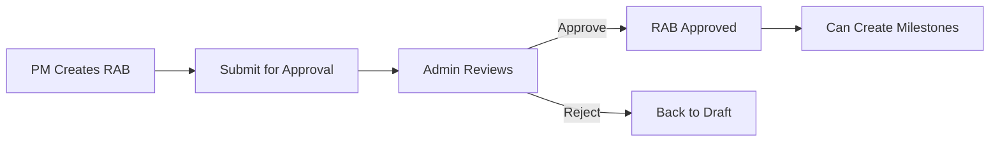

**API Endpoints**:
```
GET    /api/projects/:id/rab                  - List RAB items
POST   /api/projects/:id/rab                  - Create single RAB
POST   /api/projects/:id/rab/bulk             - Bulk create RAB
GET    /api/projects/:id/rab/:rabId           - RAB detail
PUT    /api/projects/:id/rab/:rabId           - Update RAB
DELETE /api/projects/:id/rab/:rabId           - Delete RAB
POST   /api/projects/:id/rab/:rabId/approve   - Approve RAB
POST   /api/projects/:id/rab/:rabId/reject    - Reject RAB
POST   /api/projects/:id/rab/approve-all      - Bulk approve
PATCH  /api/projects/:id/rab/:rabId/status    - Update status
```

---

### 3. 📋 Milestone Proyek

**Entity**: `ProjectMilestone`

**Fitur**:
- ✅ Create milestone dari RAB
- ✅ Auto-suggest milestone berdasarkan RAB categories
- ✅ Track progress (0-100%)
- ✅ Status: planned, in-progress, completed, delayed
- ✅ Assign to user
- ✅ Due date tracking
- ✅ Photo upload untuk progress
- ✅ Sync dengan RAB costs

**Workflow**:
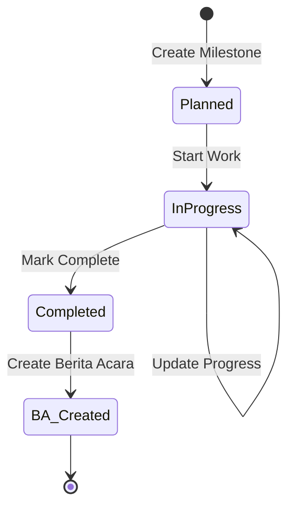

**API Endpoints**:
```
GET    /api/projects/:id/milestones                    - List milestones
POST   /api/projects/:id/milestones                    - Create milestone
GET    /api/projects/:id/milestones/suggest            - Auto-suggest from RAB
GET    /api/projects/:id/milestones/rab-categories     - Get RAB categories
GET    /api/projects/:id/milestones/:milestoneId       - Milestone detail
PUT    /api/projects/:id/milestones/:milestoneId       - Update milestone
PUT    /api/projects/:id/milestones/:milestoneId/complete  - Mark complete
DELETE /api/projects/:id/milestones/:milestoneId       - Delete milestone
POST   /api/projects/:id/milestones/:milestoneId/sync  - Sync with RAB
```

---

### 4. 📝 Berita Acara (BA)

**Entity**: `BeritaAcara`

**Fitur**:
- ✅ Create BA dari completed milestone
- ✅ Document progress & completion
- ✅ Photo evidence upload
- ✅ Multi-level approval (PM → Admin → Client)
- ✅ Digital signature with QR code
- ✅ Client sign-off
- ✅ PDF generation
- ✅ Integration dengan Progress Payment

**Workflow Approval**:
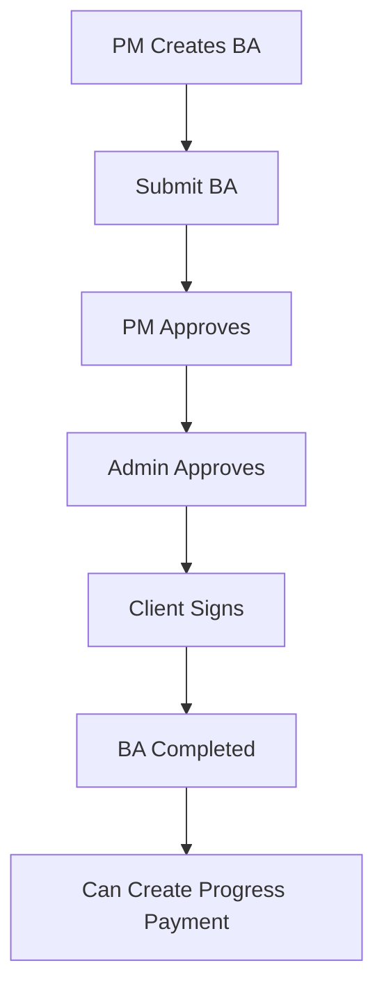

**Status**:
- `draft` - Sedang dibuat
- `submitted` - Submitted for approval
- `pm_approved` - Approved by PM
- `admin_approved` - Approved by Admin
- `client_signed` - Signed by client (final)
- `rejected` - Ditolak

**API Endpoints**:
```
GET    /api/projects/:projectId/berita-acara             - List BA
POST   /api/projects/:projectId/berita-acara             - Create BA
GET    /api/projects/:projectId/berita-acara/:baId       - BA detail
PATCH  /api/projects/:projectId/berita-acara/:baId       - Update BA
POST   /api/projects/:projectId/berita-acara/:baId/submit     - Submit
PATCH  /api/projects/:projectId/berita-acara/:baId/approve    - Approve
PATCH  /api/projects/:projectId/berita-acara/:baId/reject     - Reject
POST   /api/projects/:projectId/berita-acara/:baId/client-sign - Client sign
DELETE /api/projects/:projectId/berita-acara/:baId       - Delete BA
```

---

### 5. 💰 Progress Payment (Pembayaran Bertahap)

**Entity**: `ProgressPayment`

**Fitur**:
- ✅ Create payment berdasarkan approved BA
- ✅ Calculate amount from milestone completion
- ✅ Payment terms & due date
- ✅ Invoice generation (PDF)
- ✅ Status tracking (pending → sent → confirmed → paid)
- ✅ Upload bukti pengiriman invoice
- ✅ Upload bukti pembayaran dari client
- ✅ Payment confirmation

**Workflow**:
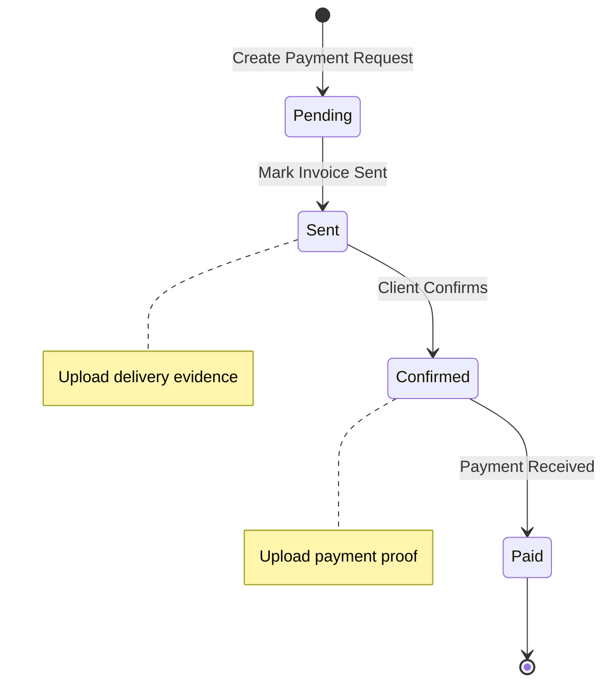

**Status**:
- `pending` - Menunggu pengiriman invoice
- `sent` - Invoice sudah dikirim ke client
- `confirmed` - Client konfirmasi akan bayar
- `paid` - Pembayaran diterima

**API Endpoints**:
```
GET    /api/projects/:projectId/progress-payments                     - List payments
POST   /api/projects/:projectId/progress-payments                     - Create payment
GET    /api/projects/:projectId/progress-payments/:paymentId          - Payment detail
PATCH  /api/projects/:projectId/progress-payments/:paymentId          - Update payment
PUT    /api/projects/:projectId/progress-payments/:paymentId/status   - Update status
PATCH  /api/projects/:projectId/progress-payments/:paymentId/mark-sent          - Mark sent
PATCH  /api/projects/:projectId/progress-payments/:paymentId/confirm-payment    - Confirm payment
GET    /api/projects/:projectId/progress-payments/:paymentId/invoice/pdf - Generate invoice PDF
DELETE /api/projects/:projectId/progress-payments/:paymentId          - Delete payment
```

---

### 6. 🛒 Purchase Order (PO) & Work Order (WO)

**Entity**: `PurchaseOrder`

**Fitur**:
- ✅ Create PO untuk material/equipment
- ✅ Create WO untuk subkontraktor
- ✅ Vendor management
- ✅ Item details (description, quantity, unit, price)
- ✅ Status tracking (draft → pending → approved → completed)
- ✅ Approval workflow
- ✅ PDF generation
- ✅ Invoice generation
- ✅ Integration dengan Delivery Receipt

**Workflow**:
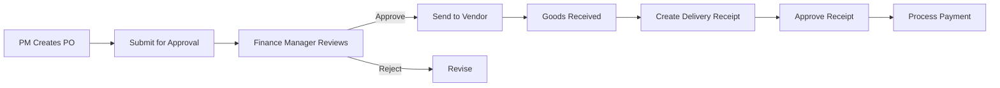

**API Endpoints**:
```
GET    /api/purchase-orders                    - List PO
POST   /api/purchase-orders                    - Create PO
GET    /api/purchase-orders/:id                - PO detail
PUT    /api/purchase-orders/:id                - Update PO
DELETE /api/purchase-orders/:id                - Delete PO
PATCH  /api/purchase-orders/:id/approve        - Approve PO
PATCH  /api/purchase-orders/:id/reject         - Reject PO
GET    /api/purchase-orders/:id/pdf            - Generate PDF
POST   /api/purchase-orders/:id/generate-invoice - Generate invoice

GET    /api/work-orders                        - List WO
POST   /api/work-orders                        - Create WO
# (similar endpoints as PO)
```

---

### 7. 📦 Delivery Receipt (Penerimaan Barang)

**Entity**: `DeliveryReceipt`

**Fitur**:
- ✅ Record penerimaan barang dari PO
- ✅ Inspection & quality control
- ✅ Quantity verification
- ✅ Status: received, inspected, approved, rejected
- ✅ Photo documentation
- ✅ Receiver, inspector, approver tracking
- ✅ Integration dengan PO

**Workflow**:
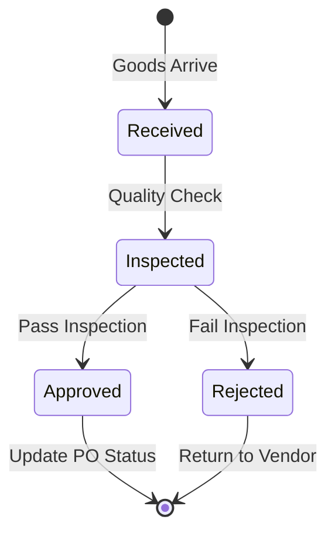

**API Endpoints**:
```
GET    /api/projects/:id/delivery-receipts                   - List receipts
POST   /api/projects/:id/delivery-receipts                   - Create receipt
GET    /api/projects/:id/delivery-receipts/available-pos     - Get available POs
GET    /api/projects/:id/delivery-receipts/:receiptId        - Receipt detail
PATCH  /api/projects/:id/delivery-receipts/:receiptId        - Update receipt
PATCH  /api/projects/:id/delivery-receipts/:receiptId/approve - Approve receipt
PATCH  /api/projects/:id/delivery-receipts/:receiptId/reject  - Reject receipt
DELETE /api/projects/:id/delivery-receipts/:receiptId        - Delete receipt
```

---

### 8. 💵 Keuangan (Finance)

#### 8.1 Chart of Accounts (COA)

**Entity**: `ChartOfAccounts`

**Fitur**:
- ✅ Hierarchical account structure (parent-child)
- ✅ Account types: Asset, Liability, Equity, Revenue, Expense
- ✅ Multi-subsidiary accounts
- ✅ Account codes (auto-generated)
- ✅ Active/inactive status
- ✅ Balance tracking

**API Endpoints**:
```
GET    /api/coa                        - List accounts
POST   /api/coa                        - Create account
GET    /api/coa/:id                    - Account detail
PUT    /api/coa/:id                    - Update account
DELETE /api/coa/:id                    - Delete account
GET    /api/coa/subsidiary/:id         - Get subsidiary accounts
```

#### 8.2 Finance Transaction

**Entity**: `FinanceTransaction`

**Fitur**:
- ✅ Record transaksi keuangan
- ✅ Link to project, PO, account
- ✅ Debit/credit tracking
- ✅ Status: pending, approved, rejected, void
- ✅ Approval workflow
- ✅ Supporting documents

**API Endpoints**:
```
GET    /api/finance/transactions           - List transactions
POST   /api/finance/transactions           - Create transaction
GET    /api/finance/transactions/:id       - Transaction detail
PUT    /api/finance/transactions/:id       - Update transaction
DELETE /api/finance/transactions/:id       - Delete transaction
POST   /api/finance/transactions/:id/approve - Approve transaction
POST   /api/finance/transactions/:id/void    - Void transaction
```

#### 8.3 Journal Entry

**Entity**: `JournalEntry`, `JournalEntryLine`

**Fitur**:
- ✅ Double-entry bookkeeping
- ✅ Multiple line items (debit/credit)
- ✅ Journal types: general, adjustment, closing
- ✅ Posting date
- ✅ Reference number
- ✅ Balance validation (debit = credit)

**API Endpoints**:
```
GET    /api/journal-entries                - List entries
POST   /api/journal-entries                - Create entry
GET    /api/journal-entries/:id            - Entry detail
PUT    /api/journal-entries/:id            - Update entry
DELETE /api/journal-entries/:id            - Delete entry
POST   /api/journal-entries/:id/post       - Post entry
```

#### 8.4 Tax Management

**Entity**: `TaxRecord`

**Fitur**:
- ✅ PPh (Pajak Penghasilan) tracking
- ✅ PPN (Pajak Pertambahan Nilai) tracking
- ✅ Tax calculation
- ✅ Tax reporting
- ✅ Link to projects & transactions

---

### 9. 👷 SDM (Manpower)

**Entity**: `Manpower`

**Fitur**:
- ✅ Employee data management
- ✅ Position & role tracking
- ✅ Current project assignment
- ✅ Contact information
- ✅ Link to user accounts (optional)
- ✅ Status: active, inactive, resigned

**API Endpoints**:
```
GET    /api/manpower                   - List employees
POST   /api/manpower                   - Create employee
GET    /api/manpower/:id               - Employee detail
PUT    /api/manpower/:id               - Update employee
DELETE /api/manpower/:id               - Delete employee
GET    /api/manpower/project/:projectId - Get project team
```

---

### 10. 🏢 Asset Management

**Entity**: `FixedAsset`

**Fitur**:
- ✅ Fixed asset tracking (equipment, vehicles, tools)
- ✅ Asset categories
- ✅ Acquisition cost & depreciation
- ✅ Maintenance records
- ✅ Location tracking
- ✅ Status: available, in-use, maintenance, disposed

⚠️ **Catatan**: Ini BUKAN inventory management untuk material! Hanya untuk fixed asset.

**API Endpoints**:
```
GET    /api/assets                     - List assets
POST   /api/assets                     - Create asset
GET    /api/assets/:id                 - Asset detail
PUT    /api/assets/:id                 - Update asset
DELETE /api/assets/:id                 - Delete asset
POST   /api/assets/:id/maintenance     - Record maintenance
```

---

### 11. ⏰ Attendance System (PWA)

**Entities**: `AttendanceRecord`, `ProjectLocation`, `AttendanceSettings`, `LeaveRequest`

**Fitur**:
- ✅ Clock in/out dengan GPS
- ✅ Geofencing (radius validation)
- ✅ Photo capture (selfie)
- ✅ Project location tracking
- ✅ Late/early tracking
- ✅ Overtime calculation
- ✅ Leave request & approval
- ✅ Monthly attendance summary
- ✅ PWA support (offline-capable)

**Workflow Clock In**:
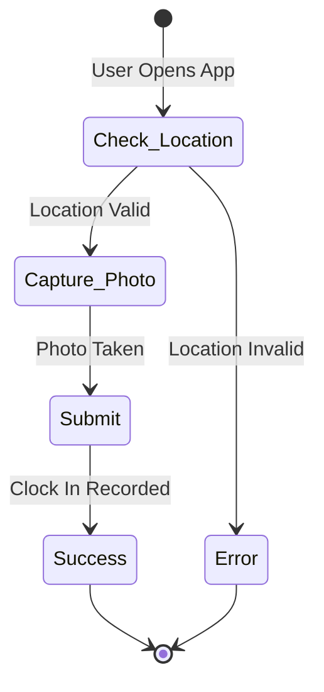

**API Endpoints**:
```
POST   /api/attendance/clock-in        - Clock in
POST   /api/attendance/clock-out       - Clock out
GET    /api/attendance/history         - Attendance history
GET    /api/attendance/summary         - Monthly summary
POST   /api/attendance/leave-request   - Create leave request
GET    /api/attendance/leave-requests  - List leave requests
PATCH  /api/attendance/leave-requests/:id/approve - Approve leave
GET    /api/attendance/settings        - Get attendance settings
PUT    /api/attendance/settings        - Update settings
```

---

### 12. 🏢 Multi-Subsidiary

**Entity**: `Subsidiary`

**Fitur**:
- ✅ Multiple company/subsidiary management
- ✅ Subsidiary-specific projects
- ✅ Subsidiary-specific COA
- ✅ Consolidated reporting
- ✅ Logo & branding per subsidiary

**API Endpoints**:
```
GET    /api/subsidiaries               - List subsidiaries
POST   /api/subsidiaries               - Create subsidiary
GET    /api/subsidiaries/:id           - Subsidiary detail
PUT    /api/subsidiaries/:id           - Update subsidiary
DELETE /api/subsidiaries/:id           - Delete subsidiary
GET    /api/subsidiaries/:id/projects  - Get subsidiary projects
GET    /api/subsidiaries/:id/accounts  - Get subsidiary accounts
```

---

### 13. ✅ Approval Workflow

**Entities**: `ApprovalWorkflow`, `ApprovalInstance`, `ApprovalStep`, `ApprovalNotification`

**Fitur**:
- ✅ Multi-level approval configuration
- ✅ Role-based approvers
- ✅ Sequential approval steps
- ✅ Approval delegation
- ✅ Email/push notifications
- ✅ Approval history & audit trail

**Workflow Types**:
1. **RAB Approval** - PM → Admin
2. **BA Approval** - PM → Admin → Client
3. **PO/WO Approval** - PM → Finance Manager → Admin
4. **Payment Approval** - Finance Manager → Admin
5. **Leave Request** - Employee → Supervisor → HR

---

### 14. 🔔 Notification System

**Entities**: `Notification`, `NotificationPreference`

**Fitur**:
- ✅ Real-time push notifications (FCM)
- ✅ In-app notifications
- ✅ Email notifications (optional)
- ✅ Notification types:
  - RAB approved/rejected
  - BA approved/rejected
  - Payment received
  - PO/WO approved
  - Leave request status
  - Milestone deadline reminder
- ✅ Notification preferences per user
- ✅ Read/unread tracking
- ✅ Deep linking to relevant pages

**API Endpoints**:
```
GET    /api/notifications              - List notifications
GET    /api/notifications/unread       - Unread count
PATCH  /api/notifications/:id/read     - Mark as read
PATCH  /api/notifications/read-all     - Mark all as read
GET    /api/notifications/preferences  - Get preferences
PUT    /api/notifications/preferences  - Update preferences
POST   /api/notifications/fcm-token    - Register FCM token
```

---

### 15. 📊 Analytics & Reports

**Fitur**:
- ✅ Dashboard overview (projects, finance, manpower)
- ✅ Project performance metrics
- ✅ Budget vs actual analysis
- ✅ Cash flow reports
- ✅ Financial statements (P&L, Balance Sheet)
- ✅ Tax reports
- ✅ Manpower utilization
- ✅ Asset depreciation schedule
- ✅ Custom date range filters

**API Endpoints**:
```
GET    /api/analytics/dashboard        - Dashboard data
GET    /api/analytics/projects         - Project analytics
GET    /api/analytics/finance          - Financial analytics
GET    /api/analytics/manpower         - Manpower analytics
GET    /api/analytics/budget-variance  - Budget variance analysis
GET    /api/analytics/cash-flow        - Cash flow analysis
```

---

### 16. 🔧 Operations Dashboard

**Fitur**:
- ✅ System health monitoring
- ✅ Active users tracking
- ✅ Database metrics
- ✅ API performance
- ✅ Error logs
- ✅ Backup status
- ✅ Audit logs

**API Endpoints**:
```
GET    /api/operations/health          - System health
GET    /api/operations/metrics         - System metrics
GET    /api/operations/logs            - System logs
GET    /api/operations/backups         - Backup status
```

---

## 🔄 Workflow Bisnis Lengkap

### Workflow 1: Siklus Proyek Lengkap

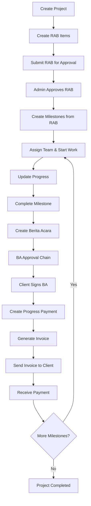

### Workflow 2: Procurement (PO/WO)

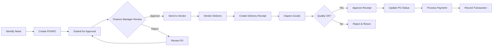

### Workflow 3: Financial Transaction

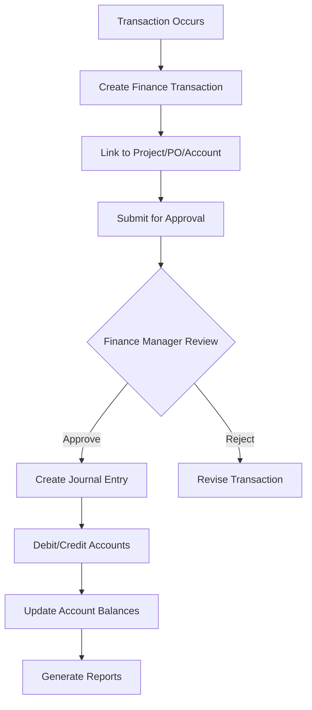

### Workflow 4: Attendance Daily

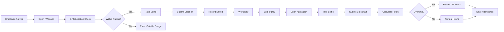

---

## 📊 Diagram Use Case per Modul

### Use Case: Manajemen Proyek

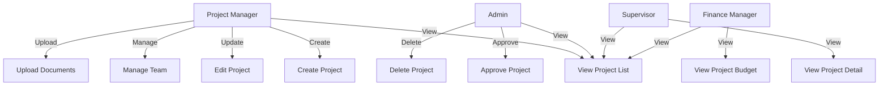

### Use Case: RAB & Milestone

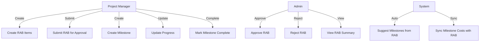

### Use Case: Berita Acara & Payment

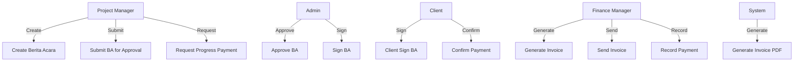

### Use Case: Purchase Order

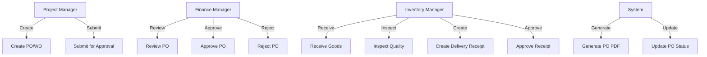

### Use Case: Attendance

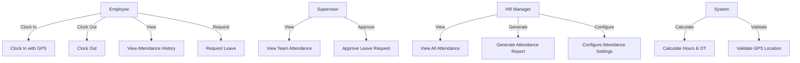

---

## 📈 Diagram Activity

### Activity: Approval RAB

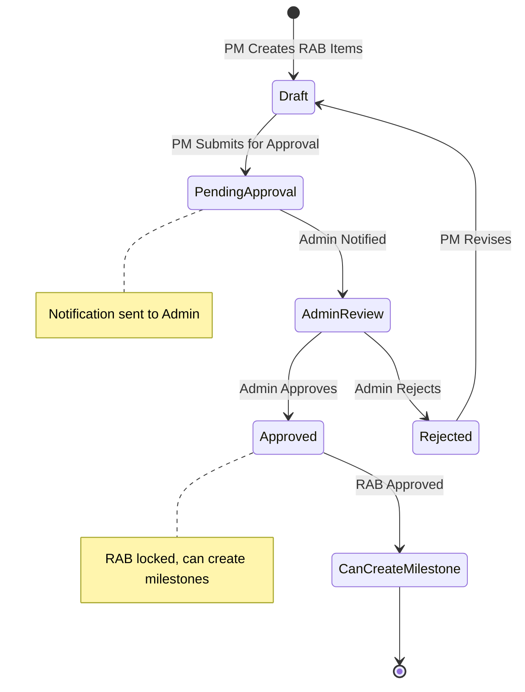

### Activity: Berita Acara Complete Flow

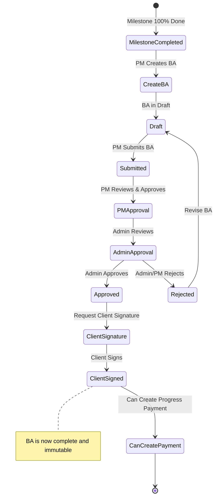

### Activity: Progress Payment Flow

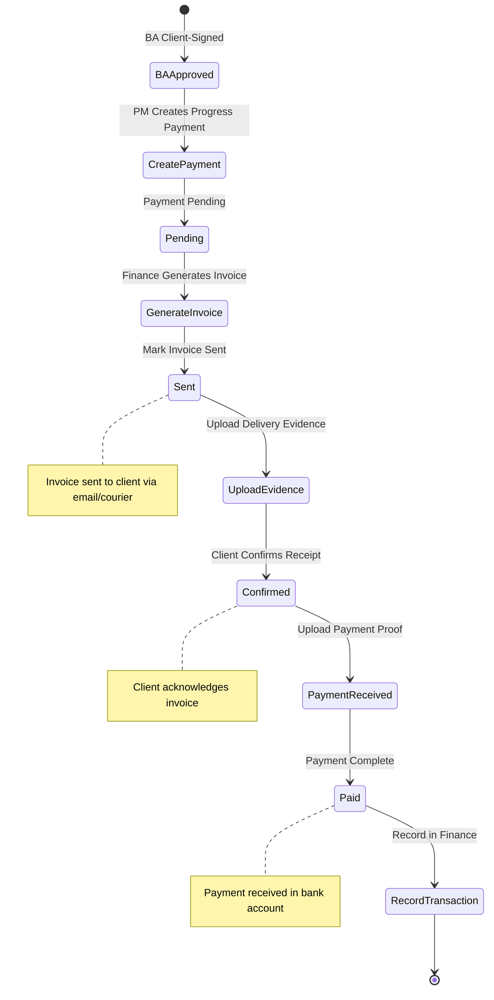

### Activity: Purchase Order Complete Flow

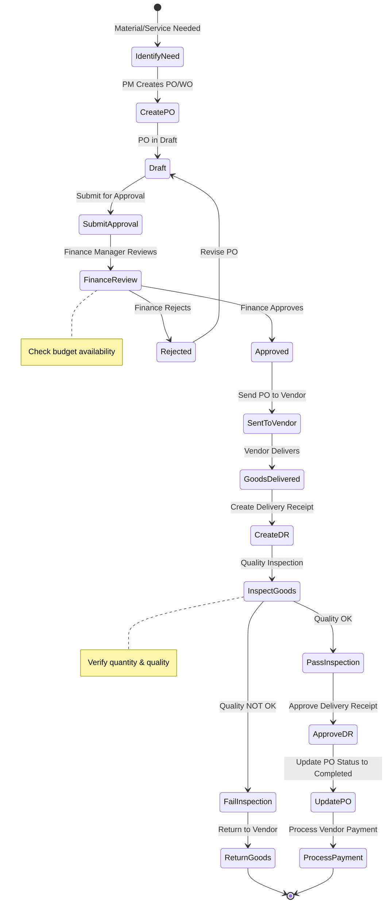

---

## 👤 Panduan Penggunaan per Role

### 🔑 Admin

**Tanggung Jawab Utama**:
- Mengelola seluruh sistem
- Approve workflows (RAB, BA, PO, Payment)
- Manage users & subsidiaries
- System configuration
- Monitoring & reporting

**Daily Tasks**:
1. Review & approve pending RAB submissions
2. Review & approve Berita Acara
3. Review & approve Purchase Orders
4. Monitor project progress
5. Review financial reports
6. Check system operations dashboard

**Menu Akses**:
- ✅ Dashboard (Full access)
- ✅ Projects (Create, Edit, Delete, Approve)
- ✅ Finance (All transactions, COA, Reports)
- ✅ Manpower (Full management)
- ✅ Assets (Full management)
- ✅ Subsidiaries (Full management)
- ✅ Users (Full management)
- ✅ Settings (System configuration)
- ✅ Operations (System monitoring)
- ✅ Analytics (All reports)

---

### 👷 Project Manager

**Tanggung Jawab Utama**:
- Manage assigned projects
- Create & track RAB
- Create & track milestones
- Create Berita Acara
- Request progress payments
- Manage project team
- Create PO/WO (perlu approval)

**Daily Tasks**:
1. Update project progress
2. Create/update RAB items
3. Create milestones from approved RAB
4. Update milestone progress
5. Create BA when milestone complete
6. Create PO/WO for procurement needs
7. Review project budget vs actual

**Menu Akses**:
- ✅ Dashboard (Project overview)
- ✅ Projects (Own projects: Create, Edit, View)
- ✅ RAB (Create, Submit for approval)
- ✅ Milestones (Create, Track, Complete)
- ✅ Berita Acara (Create, Submit)
- ✅ Progress Payment (Request)
- ✅ Purchase Orders (Create, View)
- ✅ Manpower (View team, Assign to projects)
- ✅ Analytics (Own project reports)
- ❌ Cannot approve RAB/BA/PO
- ❌ Cannot manage users
- ❌ Cannot manage subsidiaries

**Workflow PM**:
```
1. Create Project
   ↓
2. Create RAB Items → Submit untuk Admin approval
   ↓
3. Setelah RAB approved → Create Milestones
   ↓
4. Assign team → Start work
   ↓
5. Update progress secara berkala
   ↓
6. Milestone complete → Create Berita Acara
   ↓
7. BA approved & client signed → Request Progress Payment
   ↓
8. Repeat untuk milestone berikutnya
```

---

### 💰 Finance Manager

**Tanggung Jawab Utama**:
- Approve PO/WO
- Process payments
- Manage Chart of Accounts
- Create journal entries
- Generate invoices
- Financial reporting
- Tax management

**Daily Tasks**:
1. Review & approve pending PO/WO
2. Process progress payments
3. Generate & send invoices
4. Record incoming payments
5. Create journal entries
6. Review financial reports
7. Monitor cash flow

**Menu Akses**:
- ✅ Dashboard (Financial overview)
- ✅ Finance (Full access: Transactions, COA, Journals, Tax)
- ✅ Projects (View, Budget monitoring)
- ✅ Purchase Orders (Approve/Reject)
- ✅ Progress Payments (Process, Generate invoices)
- ✅ Analytics (Financial reports)
- ❌ Cannot create/edit projects
- ❌ Cannot create RAB/Milestones
- ❌ Cannot create BA

**Workflow Finance**:
```
PO/WO Flow:
1. Receive PO/WO approval request
   ↓
2. Review budget & vendor
   ↓
3. Approve/Reject
   ↓
4. Track delivery & payment

Payment Flow:
1. Receive payment request from PM
   ↓
2. Verify approved BA
   ↓
3. Generate invoice PDF
   ↓
4. Send invoice to client
   ↓
5. Record payment received
   ↓
6. Create journal entry
```

---

### 👁️ Supervisor

**Tanggung Jawab Utama**:
- Monitor assigned projects
- View reports
- Update progress (limited)
- Approve leave requests
- Clock in/out attendance

**Daily Tasks**:
1. Clock in (morning)
2. Monitor project progress
3. View team attendance
4. Review & approve leave requests
5. Clock out (evening)

**Menu Akses**:
- ✅ Dashboard (View only)
- ✅ Projects (View only)
- ✅ Attendance (Clock in/out, View history)
- ✅ Leave Requests (Approve for team)
- ✅ Analytics (View reports)
- ❌ Cannot create/edit projects
- ❌ Cannot create RAB/BA/PO
- ❌ Cannot approve workflows

---

### 📦 Inventory Manager

⚠️ **Catatan**: Role ini terbatas karena sistem tidak punya modul inventory penuh!

**Tanggung Jawab Utama**:
- Manage fixed assets (equipment, vehicles, tools)
- Receive & inspect deliveries
- Create delivery receipts
- Track asset maintenance

**Daily Tasks**:
1. Receive goods from vendors
2. Inspect quality
3. Create delivery receipts
4. Update asset records
5. Track equipment location & status

**Menu Akses**:
- ✅ Assets (Full management)
- ✅ Delivery Receipts (Create, Approve)
- ✅ Purchase Orders (View)
- ✅ Dashboard (Asset overview)
- ❌ No material inventory management
- ❌ No stock management

---

### 👥 HR Manager

⚠️ **Catatan**: Role ini sangat terbatas karena sistem tidak punya modul HR penuh!

**Tanggung Jawab Utama**:
- Manage employee data (manpower)
- View attendance reports
- Approve leave requests
- Link user accounts to employees

**Daily Tasks**:
1. Update employee data
2. Review attendance reports
3. Approve leave requests
4. Link new users to employees

**Menu Akses**:
- ✅ Manpower (Full management)
- ✅ Attendance (View all reports)
- ✅ Leave Requests (Approve)
- ✅ Users (Link to employees)
- ❌ No payroll
- ❌ No recruitment
- ❌ No training management
- ❌ No performance reviews

---

## 🎯 Matrix Role vs Fitur

| Fitur | Admin | PM | Finance | Supervisor | Inventory | HR |
|-------|-------|-----|---------|------------|-----------|-----|
| **Dashboard** | Full | Project View | Finance View | Read Only | Asset View | Manpower View |
| **Projects** | CRUD + Approve | CRUD | Read | Read | Read | Read |
| **RAB** | Approve/Reject | Create/Submit | Read | Read | - | - |
| **Milestones** | Read | CRUD | Read | Read | - | - |
| **Berita Acara** | Approve/Reject | Create/Submit | Read | Read | - | - |
| **Progress Payment** | Approve | Request | Process | Read | - | - |
| **Purchase Orders** | Approve | Create/Submit | Approve | Read | Read | - |
| **Delivery Receipt** | Read | Read | Read | - | CRUD + Approve | - |
| **Finance Transactions** | CRUD + Approve | Read (own) | CRUD + Approve | Read | - | - |
| **Chart of Accounts** | CRUD | Read | CRUD | - | - | - |
| **Journal Entries** | Read | - | CRUD | - | - | - |
| **Assets** | CRUD | Read | Read | Read | CRUD | - |
| **Manpower** | CRUD | Read/Assign | Read | Read | - | CRUD |
| **Users** | CRUD | - | - | - | - | Link to Employee |
| **Subsidiaries** | CRUD | Read | Read | Read | Read | - |
| **Attendance** | Read All | Read Team | Read | Clock In/Out | Clock In/Out | Read All + Approve Leave |
| **Analytics** | All Reports | Project Reports | Finance Reports | Read Reports | Asset Reports | Manpower Reports |
| **Settings** | Full Access | Profile Only | Profile Only | Profile Only | Profile Only | Profile Only |
| **Operations** | Full Access | - | - | - | - | - |

**Legend**:
- **CRUD** = Create, Read, Update, Delete
- **Approve** = Can approve submissions
- **Read** = View only
- **-** = No access

---

## 📱 Progressive Web App (PWA) Features

Sistem ini mendukung PWA untuk fitur attendance:

### Fitur PWA:
- ✅ Install di homescreen (Android/iOS)
- ✅ Offline capability
- ✅ Push notifications
- ✅ Camera access (selfie)
- ✅ GPS location access
- ✅ Fast loading
- ✅ App-like experience

### Cara Install PWA:
**Android (Chrome)**:
1. Buka https://nusantaragroup.co
2. Klik menu (⋮) → "Add to Home screen"
3. Icon app akan muncul di home screen

**iOS (Safari)**:
1. Buka https://nusantaragroup.co
2. Klik Share button
3. Pilih "Add to Home Screen"
4. Icon app akan muncul di home screen

---

## 🔒 Keamanan & Permission

### Authentication:
- JWT token-based authentication
- Token expiry: 24 jam
- Refresh token support
- Password hashing (bcryptjs)

### Authorization:
- Role-based access control (RBAC)
- Route-level permissions
- API endpoint permissions
- Feature-level restrictions

### Audit Trail:
- User actions logged
- Approval history tracked
- Change history for critical data
- Login/logout tracking

---

## 🌐 Production Environment

**URL**: https://nusantaragroup.co

**Server**:
- OS: Linux (Docker)
- Web Server: Nginx
- SSL: Let's Encrypt
- Database: PostgreSQL 15

**Monitoring**:
- System health check
- Error logging
- Performance metrics
- Backup automation

---

## 📝 Catatan Penting

### ⚠️ Klarifikasi Role yang Ada Tapi Fiturnya Terbatas:

1. **Inventory Manager Role**:
   - Role ada di sistem (`inventory_manager`)
   - TAPI tidak ada modul inventory management penuh
   - Hanya manage fixed assets (equipment, vehicles, tools)
   - Tidak ada stock material management
   - Tidak ada material requisition
   - Rekomendasi: Gunakan role ini untuk Asset Manager

2. **HR Manager Role**:
   - Role ada di sistem (`hr_manager`)
   - TAPI tidak ada modul HR penuh
   - Hanya manage data manpower (SDM)
   - Tidak ada payroll system
   - Tidak ada recruitment module
   - Tidak ada training/performance management
   - Rekomendasi: Gunakan role ini untuk Manpower Manager

### ✅ Fitur yang Lengkap & Production-Ready:

1. **Project Management** - Fully implemented
2. **RAB/BOQ** - Fully implemented with approval workflow
3. **Berita Acara** - Complete with multi-level approval
4. **Progress Payment** - Complete with invoice generation
5. **Purchase Order/Work Order** - Complete with approval workflow
6. **Finance Management** - COA, journals, transactions complete
7. **Attendance System** - Complete PWA with GPS
8. **Multi-Subsidiary** - Fully functional
9. **Approval Workflow** - Generic approval system
10. **Notifications** - Push notifications working

---

## 🚀 Roadmap (Fitur yang Bisa Ditambahkan di Masa Depan)

### Phase 1 (Q1 2026):
- [ ] Full Inventory Management (material stock)
- [ ] Material requisition workflow
- [ ] Stock opname automation
- [ ] Barcode/QR code scanning

### Phase 2 (Q2 2026):
- [ ] Payroll system
- [ ] Overtime calculation automation
- [ ] Salary slip generation
- [ ] Tax calculation (PPh 21)

### Phase 3 (Q3 2026):
- [ ] Recruitment module
- [ ] Training management
- [ ] Performance review system
- [ ] K3 (Safety) management

### Phase 4 (Q4 2026):
- [ ] Mobile app (React Native)
- [ ] Offline sync capability
- [ ] WhatsApp integration for notifications
- [ ] E-signature for documents

---

## 📞 Support & Dokumentasi

**Tim Development**:
- Developer: Available
- Support: Internal IT Team
- Documentation: File ini + inline code comments

**Cara Mendapat Bantuan**:
1. Cek dokumentasi ini terlebih dahulu
2. Cek README.md untuk technical setup
3. Contact admin untuk permission issues
4. Contact development team untuk bugs/features

---

**© 2025 Nusantara Group Karawang**  
**Version**: 2.0  
**Last Updated**: 25 Oktober 2025  
**Status**: ✅ Production Ready
