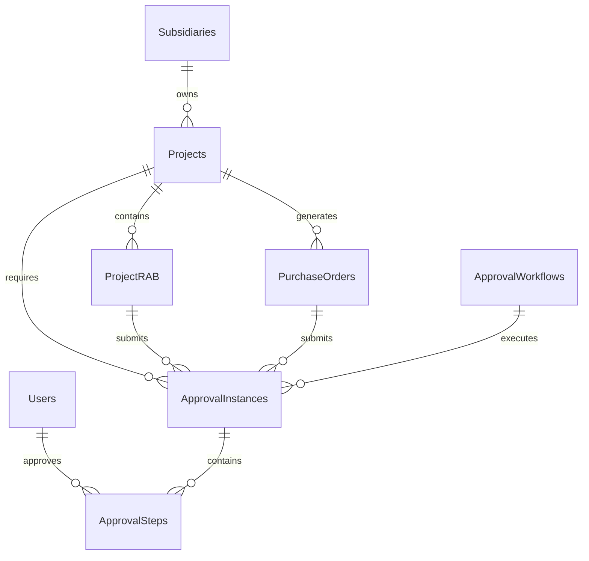
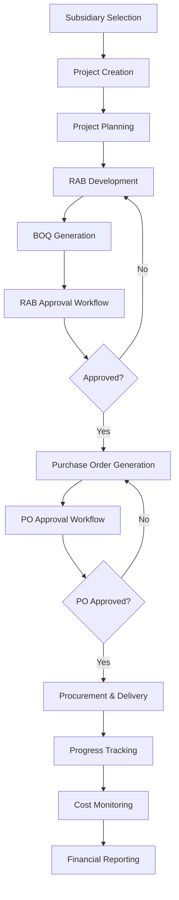

# 📊 ANALISIS SISTEMATIS: INTEGRASI WORKFLOW CONSTRUCTION MANAGEMENT
## Audit Komprehensif Frontend-Backend Integration

---

## 🔍 **CURRENT STATE ANALYSIS**

### **📋 1. DATABASE SCHEMA & RELATIONS MAPPING**

#### **Entity Relationship Overview:**



#### **✅ Database Relations Status:**
- **Subsidiaries** ✅ Complete (dengan project assignments)
- **Projects** ✅ Complete (dengan RAB, PO, approval links)
- **ProjectRAB** ✅ Complete (dengan approval tracking)
- **PurchaseOrders** ✅ Complete (dengan project links)
- **ApprovalWorkflow** ✅ Complete (multi-level system)
- **Users & Roles** ✅ Complete (dengan approval permissions)

---

### **🌐 2. BACKEND API ENDPOINTS AUDIT**

#### **✅ Available & Complete APIs:**

| **Module** | **Endpoints** | **Status** | **Integration Level** |
|------------|---------------|------------|----------------------|
| **Approval System** | `/api/approval/*` | ✅ Complete | **FULL** - Dashboard ready |
| **Projects** | `/api/projects/*` | ✅ Complete | **PARTIAL** - Missing workflow |
| **Subsidiaries** | `/api/subsidiaries/*` | ✅ Complete | **MINIMAL** - Not in main flow |
| **Purchase Orders** | `/api/purchase-orders/*` | ✅ Complete | **NONE** - Isolated |
| **Financial Reports** | `/api/financial-reports/*` | ✅ Complete | **PARTIAL** - Analytics only |
| **Manpower/HR** | `/api/manpower/*` | ✅ Complete | **PARTIAL** - Standalone |
| **Inventory** | `/api/inventory/*` | ✅ Complete | **NONE** - Not connected |

#### **🔗 API Integration Gaps Identified:**

```javascript
// MISSING INTEGRATIONS:
1. Projects → RAB → BOQ workflow
2. RAB → Purchase Order generation
3. Purchase Orders → Approval workflow
4. Subsidiaries → Project assignments in UI
5. Inventory → Project material requirements
6. Financial Reports → Project cost tracking
```

---

### **🎨 3. FRONTEND UI/UX AUDIT**

#### **Current Menu Structure Analysis:**

```javascript
// CURRENT SIDEBAR MENU:
menuItems = [
  'Dashboard',           // ✅ Basic KPI cards
  'Proyek',             // ✅ CRUD projects only
  'Persetujuan',        // ✅ Approval dashboard (NEW)
  'Inventory',          // ❌ Disconnected from projects
  'SDM',                // ❌ Standalone HR module
  'Keuangan',           // ❌ Basic finance only
  'Perusahaan',         // ❌ Subsidiary CRUD only
  'Laporan',            // ❌ Analytics without context
  'Pengaturan'          // ❌ Basic settings
]
```

#### **❌ UI Integration Problems:**

1. **Siloed Modules**: Setiap modul berdiri sendiri tanpa workflow connection
2. **Missing Context**: Tidak ada business process flow antar modules
3. **No Cross-Module Navigation**: User harus manual switch antar modules
4. **Incomplete Workflows**: Proses bisnis konstruksi tidak tercermin di UI
5. **Inconsistent Data Flow**: Data tidak mengalir natural antar modules

---

## 🎯 **RECOMMENDED INTEGRATION ARCHITECTURE**

### **📐 1. Business Process Flow Design**



### **🎨 2. Integrated UI Architecture**

#### **A. Context-Aware Dashboard**
```javascript
// ENHANCED DASHBOARD WITH CONTEXT:
dashboardSections = {
  "Project Overview": {
    cards: ["Active Projects", "Pending Approvals", "Budget Status"],
    actions: ["New Project", "Review Approvals", "View Reports"]
  },
  "Workflow Status": {
    cards: ["RAB Pending", "PO Waiting", "Deliveries Due"],
    quickActions: ["Approve RAB", "Process PO", "Update Progress"]
  },
  "Financial Summary": {
    cards: ["Total Budget", "Committed Amount", "Available Balance"],
    drillDown: ["Project Costs", "Subsidiary Performance"]
  }
}
```

#### **B. Enhanced Menu with Workflow Integration**
```javascript
// PROPOSED INTEGRATED MENU:
integratedMenu = [
  {
    id: 'dashboard',
    label: 'Dashboard',
    contextual: true, // Shows relevant data based on user role
    widgets: ['project-status', 'approval-queue', 'budget-alerts']
  },
  {
    id: 'projects',
    label: 'Manajemen Proyek',
    submenu: [
      'Daftar Proyek',
      'Buat Proyek Baru',
      'RAB Management',
      'BOQ Integration',
      'Progress Tracking'
    ],
    integrations: ['subsidiaries', 'approval', 'finance']
  },
  {
    id: 'approval',
    label: 'Workflow Persetujuan',
    submenu: [
      'Dashboard Approval',
      'RAB Approvals',
      'PO Approvals',
      'Change Orders',
      'History & Audit'
    ],
    contextual: true // Different views per role
  },
  {
    id: 'procurement',
    label: 'Pengadaan & Inventori',
    submenu: [
      'Purchase Orders',
      'Supplier Management',
      'Inventory Tracking',
      'Delivery Monitoring'
    ],
    integrations: ['projects', 'approval', 'finance']
  },
  {
    id: 'finance',
    label: 'Keuangan Terintegrasi',
    submenu: [
      'Budget Overview',
      'Cost Tracking',
      'Financial Reports',
      'Payment Status',
      'Subsidiary Consolidation'
    ],
    integrations: ['projects', 'subsidiaries', 'approval']
  }
]
```

---

## 🚀 **IMPLEMENTATION ROADMAP**

### **🎯 PHASE 1: Core Workflow Integration (Week 1-2)**

#### **1.1 Enhanced Project Module**
```javascript
// FILE: /src/pages/ProjectDetail.js
// ENHANCEMENT: Add integrated tabs

const ProjectDetailTabs = [
  'Project Info',           // ✅ Existing
  'RAB Management',         // 🔄 Enhanced with approval flow
  'Purchase Orders',        // 🆕 New integration
  'Approval Status',        // 🆕 Real-time approval tracking
  'Budget Monitoring',      // 🆕 Financial integration
  'Team & Resources'        // 🔄 Enhanced with inventory
]
```

#### **1.2 Contextual Dashboard Enhancement**
```javascript
// FILE: /src/pages/Dashboard.js
// ENHANCEMENT: Role-based contextual widgets

const roleBasedWidgets = {
  'project_manager': [
    'MyProjectsOverview',
    'PendingApprovals',
    'BudgetAlerts',
    'TeamUpdates'
  ],
  'finance_director': [
    'FinancialSummary',
    'ApprovalQueue',
    'BudgetVariance',
    'CashFlowForecast'
  ],
  'operations_director': [
    'ProjectProgress',
    'ResourceUtilization',
    'ProcurementStatus',
    'DeliverySchedule'
  ]
}
```

#### **1.3 Integrated Approval Dashboard**
```javascript
// FILE: /src/components/ApprovalDashboard.js
// ENHANCEMENT: Add context switching

const approvalContexts = {
  'rab': {
    title: 'RAB Approvals',
    fields: ['project', 'total_amount', 'submitted_date'],
    actions: ['review', 'approve', 'reject', 'request_revision']
  },
  'purchase_order': {
    title: 'Purchase Order Approvals',
    fields: ['po_number', 'supplier', 'amount', 'delivery_date'],
    actions: ['approve', 'reject', 'negotiate']
  }
}
```

### **🎯 PHASE 2: Business Process Integration (Week 3-4)**

#### **2.1 RAB → BOQ → PO Workflow**
```javascript
// FILE: /src/components/RABWorkflow.js
// NEW: Complete RAB to PO workflow

const RABWorkflow = {
  stages: [
    'rab_creation',
    'boq_generation',
    'approval_submission',
    'approval_process',
    'po_generation',
    'procurement'
  ],
  integrations: {
    approval: 'ApprovalService',
    procurement: 'PurchaseOrderService',
    inventory: 'InventoryService'
  }
}
```

#### **2.2 Cross-Module Navigation**
```javascript
// FILE: /src/components/Layout/Sidebar.js
// ENHANCEMENT: Smart navigation with context

const smartNavigation = {
  'from_project_rab': {
    suggestedNext: [
      'Submit for Approval',
      'Generate Purchase Orders',
      'View Budget Impact'
    ]
  },
  'from_approval_approved': {
    suggestedNext: [
      'Generate PO',
      'Update Project Status',
      'Notify Stakeholders'
    ]
  }
}
```

### **🎯 PHASE 3: Advanced Integration Features (Week 5-6)**

#### **3.1 Real-time Integration Dashboard**
```javascript
// FILE: /src/components/IntegratedDashboard.js
// NEW: Real-time cross-module dashboard

const IntegratedDashboard = {
  sections: {
    'project_pipeline': {
      data: 'projects + rab + approvals',
      visualization: 'Kanban Board',
      actions: ['Move to Next Stage', 'Request Information']
    },
    'financial_overview': {
      data: 'projects + rab + po + actual_costs',
      visualization: 'Budget vs Actual Chart',
      drillDown: 'project_level_details'
    },
    'approval_bottlenecks': {
      data: 'approval_instances + sla_tracking',
      visualization: 'Alert Cards',
      actions: ['Escalate', 'Reassign', 'Expedite']
    }
  }
}
```

#### **3.2 Smart Forms with Context**
```javascript
// FILE: /src/components/SmartForms/
// NEW: Context-aware form generation

const contextualForms = {
  'create_po_from_rab': {
    prePopulated: ['project_info', 'approved_amounts', 'specifications'],
    validation: ['budget_limits', 'approval_requirements'],
    workflow: ['auto_submit_approval', 'notify_stakeholders']
  },
  'submit_rab_approval': {
    context: ['project_details', 'budget_constraints', 'approval_matrix'],
    attachments: ['required_documents', 'supporting_calculations'],
    routing: ['determine_approvers', 'set_deadlines']
  }
}
```

---

## 🎨 **UI/UX DESIGN PRINCIPLES**

### **1. Contextual Information Architecture**

```javascript
// PRINCIPLE: Every screen should show relevant context
const contextualDesign = {
  'always_visible': [
    'current_project_context',
    'user_role_capabilities',
    'pending_actions'
  ],
  'contextual_sidebars': [
    'related_documents',
    'workflow_status',
    'stakeholder_info'
  ],
  'smart_suggestions': [
    'next_logical_steps',
    'related_data',
    'process_guidance'
  ]
}
```

### **2. Progressive Disclosure**

```javascript
// PRINCIPLE: Show what's needed, hide complexity
const progressiveDisclosure = {
  'summary_level': 'Key metrics and status',
  'detail_level': 'Full data with filters',
  'admin_level': 'Complete control and configuration',
  'drill_down': 'Seamless navigation between levels'
}
```

### **3. Workflow-Centric Navigation**

```javascript
// PRINCIPLE: Navigate by business process, not by system module
const workflowNavigation = {
  'primary_flows': [
    'Project Initiation → Approval → Execution',
    'Budget Planning → Approval → Procurement',
    'Progress Tracking → Reporting → Analysis'
  ],
  'cross_cutting_concerns': [
    'Approvals Dashboard',
    'Financial Monitoring',
    'Document Management'
  ]
}
```

---

## 📋 **IMPLEMENTATION CHECKLIST**

### **Phase 1: Foundation (Week 1-2)**

- [ ] **Enhanced Project Detail Page**
  - [ ] Add RAB management tab with approval integration
  - [ ] Add Purchase Orders tab with workflow
  - [ ] Add Budget monitoring with real-time data
  - [ ] Add approval status tracking

- [ ] **Improved Sidebar Navigation**
  - [ ] Group related modules logically
  - [ ] Add contextual submenu items
  - [ ] Implement smart navigation suggestions
  - [ ] Add workflow progress indicators

- [ ] **Dashboard Contextualization**
  - [ ] Role-based widget arrangement
  - [ ] Cross-module data integration
  - [ ] Actionable insights and quick actions
  - [ ] Real-time status updates

### **Phase 2: Workflow Integration (Week 3-4)**

- [ ] **RAB → Approval → PO Workflow**
  - [ ] Implement seamless RAB submission flow
  - [ ] Add approval status tracking in RAB module
  - [ ] Auto-generate PO from approved RAB
  - [ ] Implement PO approval workflow

- [ ] **Cross-Module Data Flow**
  - [ ] Project selection affects all related modules
  - [ ] Subsidiary context flows through workflows
  - [ ] Financial data updates across modules
  - [ ] Inventory availability in PO creation

- [ ] **Smart Forms and Wizards**
  - [ ] Context-aware form pre-population
  - [ ] Workflow-guided form validation
  - [ ] Smart defaults based on project data
  - [ ] Integrated document upload/management

### **Phase 3: Advanced Features (Week 5-6)**

- [ ] **Real-time Integration Dashboard**
  - [ ] Live workflow status board
  - [ ] Cross-module analytics
  - [ ] Bottleneck identification
  - [ ] Performance metrics

- [ ] **Advanced User Experience**
  - [ ] Smart notifications and alerts
  - [ ] Predictive suggestions
  - [ ] Batch operations
  - [ ] Mobile responsiveness

---

## 🎯 **SUCCESS METRICS**

### **User Experience Metrics:**
- **Navigation Efficiency**: Reduce clicks between related tasks by 60%
- **Task Completion**: Improve workflow completion rate by 40%
- **User Satisfaction**: Achieve 90%+ satisfaction with integrated experience

### **Business Process Metrics:**
- **Approval Speed**: Reduce average approval time by 50%
- **Data Accuracy**: Improve cross-module data consistency by 95%
- **Process Compliance**: Achieve 100% workflow adherence

### **Technical Metrics:**
- **Performance**: Maintain <2s load times for integrated views
- **Reliability**: 99.9% uptime for integrated workflows
- **Scalability**: Support 100+ concurrent users

---

## 🔧 **TECHNICAL IMPLEMENTATION NOTES**

### **Frontend Architecture:**
- **State Management**: Use React Context for cross-module state
- **Component Library**: Material-UI with custom integrated components
- **Data Fetching**: React Query for efficient cross-module data management
- **Routing**: Enhanced React Router with workflow-aware navigation

### **Integration Patterns:**
- **Service Layer**: Unified services for cross-module operations
- **Event System**: Real-time updates across modules
- **Caching Strategy**: Smart caching for frequently accessed integrated data
- **Error Handling**: Consistent error handling across workflows

---

**🎉 CONCLUSION**: Implementasi roadmap ini akan mengubah sistem dari sekumpulan modul terpisah menjadi platform konstruksi yang terintegrasi penuh, meningkatkan efisiensi, akurasi, dan user experience secara signifikan.
