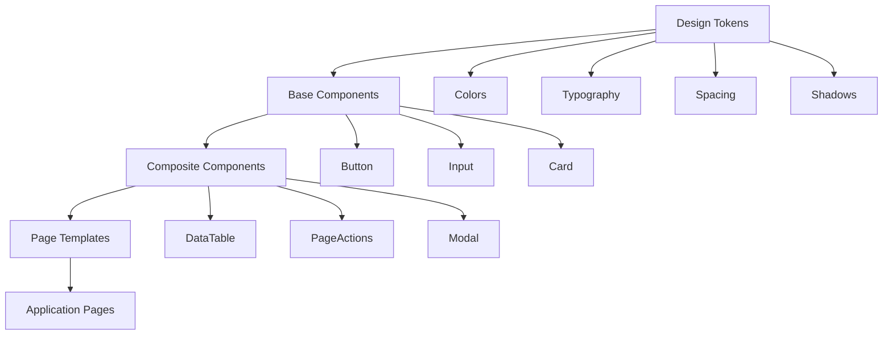
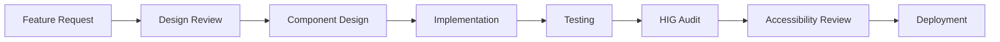
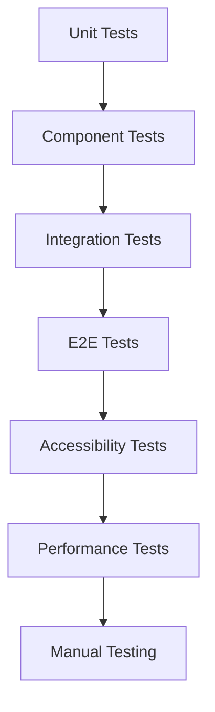

# Documentation Index

## 📚 YK Construction - Complete Documentation Suite

Selamat datang di dokumentasi lengkap sistem YK Construction. Dokumentasi ini diorganisir mengikuti **Apple Human Interface Guidelines** dan industry best practices untuk memastikan consistency, accessibility, dan maintainability.

## 🎯 Quick Navigation

### 🎨 Design & User Experience
| Document | Description | Audience |
|----------|-------------|----------|
| **[Design System](./design-system.md)** | Design tokens, color palette, typography, spacing system | Designers, Frontend Developers |
| **[Component Library](./component-library.md)** | Reusable UI components dengan implementation guides | Frontend Developers |
| **[UI/UX Guidelines](./ui-ux-guidelines.md)** | Apple HIG compliance dan interaction patterns | Designers, Product Managers |
| **[Accessibility Guidelines](./accessibility-guidelines.md)** | WCAG 2.1 compliance dan testing procedures | All Team Members |

### 📋 Project Management
| Document | Description | Audience |
|----------|-------------|----------|
| **[README](./README.md)** | Project overview dan getting started guide | All Stakeholders |
| **[HIG Audit Report](./admin-hig-audit.md)** | Comprehensive audit dan improvement roadmap | Product Team, QA |
| **[Requirements Analysis](./analisis_kebutuhan.md)** | Business requirements dan technical specifications | Business Analysts, Developers |
| **[Development Phases](./kerangka_phase.txt)** | Project timeline dan delivery milestones | Project Managers, Developers |

## 🎨 Design Documentation

### Design System Overview
Sistem design YK Construction dibangun di atas foundation yang solid dengan prinsip-prinsip berikut:

- **Consistency**: Unified design language across all interfaces
- **Accessibility**: WCAG 2.1 Level AA compliance
- **Performance**: Optimized for fast loading dan smooth interactions
- **Maintainability**: Modular components dengan clear documentation

### Key Design Principles

1. **Clarity** - Content is king, interface supports content
2. **Deference** - UI defers to content, minimal distractions  
3. **Depth** - Visual layers dan motion convey hierarchy

### Component Architecture



## 🔧 Technical Documentation

### Frontend Architecture
- **Framework**: React 18+ dengan Concurrent Features
- **Styling**: Tailwind CSS dengan custom design tokens
- **State Management**: React Context + useReducer
- **Routing**: React Router v6 dengan data loading
- **Testing**: Jest + React Testing Library
- **Build**: Create React App dengan custom webpack config

### Backend Architecture  
- **Runtime**: Node.js dengan Express.js framework
- **Authentication**: JWT dengan refresh token strategy
- **Data**: JSON files untuk development, PostgreSQL untuk production
- **API**: RESTful dengan OpenAPI specification
- **Security**: Helmet, CORS, rate limiting
- **Validation**: Joi schemas dengan error handling

### Development Workflow



## 📱 Responsive Design Strategy

### Breakpoint System
```css
/* Mobile First Approach */
--breakpoint-sm: 640px;   /* Mobile landscape */
--breakpoint-md: 768px;   /* Tablet portrait */
--breakpoint-lg: 1024px;  /* Tablet landscape / Small desktop */
--breakpoint-xl: 1280px;  /* Desktop */
--breakpoint-2xl: 1536px; /* Large desktop */
```

### Layout Patterns
- **Single Column**: Mobile portrait (< 640px)
- **Two Column**: Mobile landscape, tablet portrait (640px - 1024px)  
- **Sidebar + Content**: Desktop (> 1024px)
- **Multi-column**: Large desktop (> 1280px)

## ♿ Accessibility Standards

### WCAG 2.1 Level AA Compliance
- **Perceivable**: Text alternatives, captions, contrast
- **Operable**: Keyboard accessible, no seizures
- **Understandable**: Readable, predictable
- **Robust**: Compatible dengan assistive technologies

### Testing Strategy
1. **Automated**: ESLint a11y rules, axe-core testing
2. **Manual**: Keyboard navigation, screen reader testing
3. **User Testing**: Testing dengan users with disabilities

## 🌍 Internationalization (i18n)

### Language Support
- **Primary**: Bahasa Indonesia (id-ID)
- **Fallback**: English (en-US)
- **Locale**: Indonesian formatting untuk dates, numbers, currency

### Cultural Considerations
- **Business Context**: Indonesian construction industry
- **Regional Focus**: Karawang industrial area
- **Currency**: Indonesian Rupiah (IDR)
- **Date Format**: DD/MM/YYYY
- **Number Format**: 1.234.567,89

## 🧪 Testing Documentation

### Testing Strategy


### Test Coverage Goals
- **Unit Tests**: > 80% code coverage
- **Component Tests**: All UI components
- **Integration Tests**: API endpoints dan data flows
- **E2E Tests**: Critical user journeys
- **Accessibility Tests**: WCAG 2.1 compliance
- **Performance Tests**: Core Web Vitals benchmarks

## 🚀 Deployment & DevOps

### Environment Strategy
- **Development**: Local development dengan hot reload
- **Staging**: Production-like environment untuk testing
- **Production**: Optimized build dengan monitoring

### CI/CD Pipeline
1. **Code Quality**: ESLint, Prettier, type checking
2. **Testing**: Unit, integration, accessibility tests
3. **Build**: Optimized production build
4. **Deploy**: Automated deployment dengan rollback capability
5. **Monitor**: Performance monitoring dan error tracking

## 📊 Performance Standards

### Core Web Vitals Targets
- **First Contentful Paint**: < 1.8s
- **Largest Contentful Paint**: < 2.5s
- **First Input Delay**: < 100ms
- **Cumulative Layout Shift**: < 0.1

### Bundle Size Targets
- **Initial Bundle**: < 100KB gzipped
- **Total Bundle**: < 500KB gzipped
- **Code Splitting**: Route-based dan component-based

## 🔄 Maintenance & Updates

### Documentation Maintenance
- **Review Frequency**: Weekly updates, monthly comprehensive review
- **Version Control**: Semantic versioning untuk documentation
- **Change Management**: Documentation updates dengan code changes
- **Stakeholder Communication**: Regular updates to all stakeholders

### Component Library Maintenance
- **Deprecation Policy**: 6-month notice untuk breaking changes
- **Migration Guides**: Step-by-step guides untuk component updates
- **Backward Compatibility**: Support 2 major versions
- **Performance Monitoring**: Regular performance audits

## 👥 Team Collaboration

### Roles & Responsibilities
- **Product Manager**: Requirements, user stories, acceptance criteria
- **UX Designer**: User research, wireframes, prototypes
- **UI Designer**: Visual design, component specifications
- **Frontend Developer**: Component implementation, integration
- **Backend Developer**: API development, data modeling
- **QA Engineer**: Testing, quality assurance, bug reporting

### Communication Channels
- **Daily Standups**: Progress updates, blockers
- **Sprint Planning**: Story estimation, task breakdown
- **Design Reviews**: Component design, user flow validation
- **Code Reviews**: Code quality, best practices enforcement

## 📞 Support & Contact

### Internal Support
- **Technical Issues**: Frontend Team Lead
- **Design Questions**: UI/UX Team Lead  
- **Process Questions**: Product Manager
- **Infrastructure**: DevOps Team

### External Resources
- **Apple HIG**: [developer.apple.com/design/human-interface-guidelines](https://developer.apple.com/design/human-interface-guidelines/)
- **WCAG Guidelines**: [w3.org/WAI/WCAG21/quickref](https://www.w3.org/WAI/WCAG21/quickref/)
- **React Documentation**: [react.dev](https://react.dev)
- **Tailwind CSS**: [tailwindcss.com](https://tailwindcss.com)

---

**Documentation Version**: 1.0.0  
**Last Updated**: August 14, 2025  
**Maintained by**: Product Team  
**Review Schedule**: Weekly updates, monthly comprehensive review
